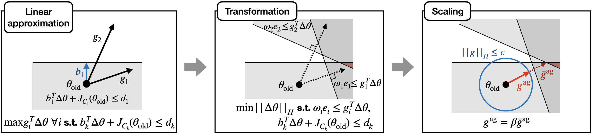

## The Purpose of This Study

multi-objective optimization에서 gradients 사이의 충돌(multiple objectives를 갖기 때문에 발생)을 관리하는 것이 중요하다.

뿐만 아니라 safety constraints를 만족하면서 안정적이고 효율적으로 학습하는 것 역시 필수적이다.

## Lit. Review

[Constrained Multi-Objective Reinforcement Learning(CMORL)](https://proceedings.mlr.press/v164/huang22a.html)

CMORL은 constrained-Pareto optimal policy set을 찾는 것이 목적(single optimal policy를 찾는 것이 아니라 safety constraints를 만족하면서 다른 어떤 정책에도 지배되지 않는)

제약 조건을 만족하는 정책 집합이 존재하는데, 그 안에서 preference에 따라 다양한 성격의 정책들이 존재한다.

이 preference를 구현하는 대표적인 방법 중 하나가 [[Paper-Reviews/Constrained RL/Stage-wise reward shaping for acrobatic robots/Review|Review]]에서 사용한 linear scalarization(구현이 직관적이라는 장점이 있음)

그러나 linear scalarization의 경우, function approximators를 적용했을 때 목적 함수의 비선형성으로 인해 local optimal로 수렴하는 경향이 있다.

Multi-task learning에서는 multi objective functions의 gradients 사이의 충돌을 피함으로써 이러한 문제를 다뤄왔다. [Conflict-Averse Gradient Descent for Multi-task learning](https://proceedings.neurips.cc/paper/2021/hash/9d27fdf2477ffbff837d73ef7ae23db9-Abstract.html)

이 논문은 위 논문을 CMORL로 확장한 것이다.

>가장 직관적인 접근법은 preferences를 동시에 조정하며 제약 조건이 임계값(threshold) 아래로 유지되도록 하는 방법이다. (이는 Lagrangian method와 같다)
>그러나 policy와 multipliers를 동시에 업데이트하기 때문에 학습을 불안정하게 한다.
>따라서 추가적인 optimization variables을 사용하지 않고 제약 조건을 관리하는 것이 중요하다.

## Background

**Constrained Multi-Objective MDP**

- Objective function of the $i$th reward
$$
J_{R_i}(\pi) := \mathbb{E} \left[ \sum^\infty_{t = 0} \gamma^t R_i (s_t, a_t, s_{t + 1}) \right]
$$

- Constrained multi-objective RL Problem

$$
\text{maximize}_{\pi} J_{R_i}(\pi) \; \forall i \in \{1, \ldots, N\} \quad \text{s.t. } J_{C_k}(\pi) \leq d_k \; \forall k \in \{ 1, \ldots, M \}
$$

**Constrained Dominance**

Given two policies $\pi_1, \pi_2 \in \{ \pi \in \Pi | J_{C_k}(\pi) \leq d_k \; \forall k \}$, $\pi_1$ is dominated by $\pi_2$ if $J_{R_i}(\pi) \leq J_{R_i}(\pi_2) \; \forall i \in \{ 1, \ldots, N \}$.

**Gradient Conflict**

Let $g_i$ be the gradient of the $i$th objective function, and let $g$ denote the policy update direction.

We say there is a gradient conflict if $\exists i$ such that $g^T_i g < 0$.

⇒ 내적이 음수 → 두 벡터가 서로 반대 방향

**Preference**

Preference Space

$$
\Omega := \{ \omega \in \mathbb{R}^N | \omega_i \geq 0, \| \omega \|_1 = 1 \}
$$

preference $\omega \in \Omega$ serves to specify the relative significance of each objective.

universal policy $\pi(\cdot | s, \omega)$ 는 preference $\omega$를 입력으로 받아, preference에 따른 최적의 행동을 수행하는 행동을 선택한다.

## Methods

- policy: $\pi_\theta$ (parameter $\theta \in \Theta$)
- objectives: $J_{R_i}(\theta)$
- constraints: $J_{C_k}(\theta)$
- gradients of the objective function: $g_i := \nabla_\theta J_{R_i} (\pi_\theta)$
- gradients of the constraint function: $b_k := \nabla_\theta J_{C_k}(\pi_\theta)$
- local region(defined using a positive definite matrix): $\| \nabla \theta \| \leq \epsilon$
	- $\| x \|_H := \sqrt{x^T H x}$ 
	- $\epsilon$: local region size (hyperparameter)
	- $H$: identity matrix or Fisher information matrix

Simplified problem where only the $i$th objective exists and then extend it to the original problem.

The problem of maximizing the $i$th objective within the local region is expressed as follows:

$$
\max_{\Delta_\theta} J_{R_i}(\theta_{\text{old}} + \Delta \theta) \quad \text{s.t. } \| \Delta \theta \|_H \leq \epsilon
$$

^bbdf3d

Assuming that $J_{R_i}(\theta)$ is linear with respect to $\theta$ within the local region, the above problem has the same solution as the following problem:

>원래 문제 [[#^bbdf3d]]에서 $J_{R_i}(\theta)$는 파라미터 $\theta$에 대한 non-linear 곡선 형태이다.
>하지만 $\theta$ 값 주변의 아주 작은 local region만 확대해서 보면 거의 직선처럼 보이기 때문에 선형 근사를 통해 풀기 쉬운 형태(quadratic form)로 변환한다.

$$
\min_{\Delta \theta} \Delta^T H \Delta \theta \quad \text{s.t. } J_{R_i}(\theta_{\text{old}} + \Delta \theta) - J_{R_i}(\theta_{\text{old}}) \geq \epsilon \| g_i \|_{H^{-1}} =: e_i
$$

^f10382

---

따라서 아래 CMORL problem도 위와 같이 변환할 수 있다.

$$
\min_{\Delta \theta} \Delta \theta^T H \Delta \theta \quad \text{s.t. } J_{R_i}(\theta_{\text{old}} + \Delta \theta) - J_{R_i}(\theta_\text{old}) \geq \omega_i e_i \quad \forall i, \; J_{C_k}(\theta_{\text{old}} + \Delta \theta) \leq d_k \quad \forall k
$$

^48c9d8

where $e_i$ in [[#^f10382]] is scaled to $\omega_i e_i$ to reflect the given preference $\omega$.

Now, we compute a policy gradient by solving [[#^48c9d8]]  within the local region using a linear approximation, similar to TRPO.

First, the problem [[#^48c9d8]] can be linearly approximated(Taylor's expansion) as the following quadratic programming (QP) problem:
$$
\bar{g}^{\text{ag}}_\omega := \arg \min_{\Delta \theta} \Delta^T \theta H \Delta \theta \quad \text{s.t. } g^T_i \Delta \theta \geq \omega_i e_i \quad \forall i, b^T_k \Delta \theta + J_{C_k}(\theta_{\text{old}}) \leq d_k \quad \forall k
$$

^987546

^f7eb76
where the gradients of the objective and constraint functions $g_i$ and $b_k$ are aggregated into $\bar{g}^{\text{ag}}_\omega$.

> 위 문장에서 aggregated가 합쳐졌다는게 아니라, 최적화 문제를 풀었을 때 나오는 모든 요구가 통합된 결과이다.

The gradient is then clipped to ensure that the policy is updated within the local region, as follows:

$$
g^{\text{ag}}_\omega := \min(1, \frac{\epsilon}{\| \bar{g}^{\text{ag}}_\omega \|_H}) \bar{g}^{\text{ag}}_\omega
$$
where the policy will be updated by $\theta_{\text{old}} + g^{\text{ag}}_\omega$.

>업데이트가 local region 내에서만($\| \bar{g}^{\text{ag}}_\omega \|_H \leq \epsilon$) 이루어지도록 clipping한다.

Note that the aggregated gradient satisfies $g^T_i g^{\text{ag}}_\omega \geq 0 \quad \forall i$ due to the reformulated constraints in [[#^987546]].

>앞서 gradient conflict를 if $\exists i$ such that $g^T_i g < 0$. 이렇게 정의했는데,
>식 [[#^987546]]에서 제약조건으로 $g^T_i \Delta \theta \geq \omega_i e_i$ 설정했기 때문에 이 제약 조건을 만족하는 $\bar{g}^{\text{ag}}_\omega$는 당연하게도 $g^T_i g^{\text{ag}}_\omega \geq 0 \quad \forall i$을 만족한다.
>따라서, gradient conflict가 발생하지 않는다.

하지만 이렇게 정책이 업데이트 되더라도, objective improvements에 지나치게 집중할 경우 제약 조건을 위반할 수 있다.

이를 해결하기 위해 논문에서는 식 [[#^987546]]에서 safety constraints만 고려하는 recovery step을 사용하였다.

$$
\bar{g}^{\text{ag}}_\omega := \arg \min_{\Delta \theta} \Delta^T \theta H \Delta \theta \quad \text{s.t. } b^T_k \Delta \theta + J_{C_k}(\theta_{\text{old}}) \leq d_k \quad \forall k
$$

이러한 과정은 아래 figure에 나타나 있다.

**Constrained Multi-Objective Gradient Aggregator (CoMOGA)**

$$
\bar{g}^{\text{ag}}_\omega =
\begin{cases}
	\arg \min_{\Delta \theta} \Delta \theta^T H \Delta \theta \; \text{s.t.} \; g^T_i \Delta \theta \geq \omega_i e_i, \; b^T_k \Delta \theta + J_{C_k}(\theta_{\text{old}}) \leq d_k &\quad \text{if} \; J_{C_k}(\theta_{\text{old}}) \leq d_k \; \forall k, \\
	\arg \min_{\Delta \theta} \Delta \theta^T H \Delta \theta \; \text{s.t.} \; b^T_k \Delta \theta + J_{C_k}(\theta_{\text{old}}) \leq d_k &\quad \text{otherwise}
\end{cases}
$$

$$
g^{\text{ag}}_\omega := \min(1, \frac{\epsilon}{\| \bar{g}^{\text{ag}}_\omega \|_H}) \bar{g}^{\text{ag}}_\omega
$$

**Update rule for universal policy**

앞서 single preference가 주어졌을 때 정책을 업데이트하는 gradient aggregation method(CoMOGA)를 소개했다.

이번에는 전체 preference space를 다룰 수 있는 universal policy를 업데이트하는 방법을 제시한다.

만약 preference $^1\omega$가 주어지면 정책은 다음과 같이 업데이트 되어야 한다. $\theta + g^{\text{ag}}_{^1\omega}$

결과적으로 이상적인 universal policy라면 다음 조건을 만족해야 한다.

$$
\pi_{\theta_{\text{new}}}(a|s,\omega) = \pi_{\theta_{\text{old}} + g^{\text{ag}}_\omega}(a|s, \omega) \quad \forall a \in A, \forall s \in S, \text{and}, \forall \omega \in \Omega
$$
where we denote $\pi_{\theta_{\text{old}} + g^{\text{ag}}_\omega}$ as an intermediate policy for $\omega$.

This can be interpreted as the KL divergence between the universal policy and the intermediate policies being zero.

Based on this property, we introduce a practical method to achieve the universal policy by minimizing the following loss:

$$
\min_{\theta} \mathbb{E}_{(\tau, \omega) \sim \mathcal{D}} \left[ \mathbb{E}_{s \sim \tau} [D_{\text{KL}}(\pi_{\theta_{\text{old}} + g^{\text{ag}}_\omega})(\cdot | s, \omega) \| \pi_\theta(\cdot | s, \omega)] \right]
$$
where $\mathcal{D}$ is a replay buffer, and $\tau$ is a trajectory.

By minimizing the above loss, we can combine policies for each preference into a single universal policy.

## Results & Discussion

## Critique