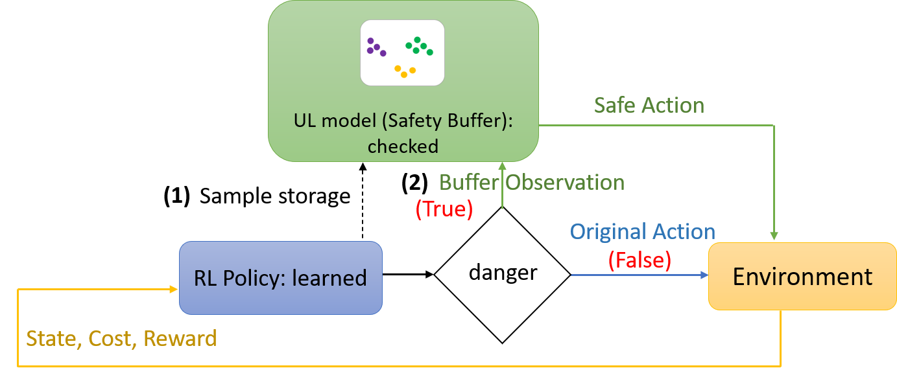

## The Purpose of This Study
강화학습에서 학습 할 때와 테스트 할 때 안정성을 보장하는 것은 주요 과제 중 하나임

이를 위해 에이전트가 위험한 상황에 있을 때 safety buffer에 저장된 recovery action을 통해 안전한 영역으로 돌아갈 수 있도록 하는 safety-aware rl 방법을 제안

## Methods

### 3. Safe Reinforcement Learning via Unsupervised Action Planning

### A. Problem Formulation

single constraint $c_t = c(s_t)$만 고려, 상태가 안전할 때는 $c(s_t) = 0$이고 실패할 때는 $c(s_t) = 1$, 그 사이 값은 위험한 상태에 있을 때를 의미

임계값 $\hat{c}$보다 클 경우 해당 상태가 위험하다고 간주

상태 $s$로부터 추출된 feature를 $b_t = b(s_t)$라고하며, 이 feature는 safety buffer에 이전 경험을 저장할 때 사용됨

### B. Safe Action Planning with Unsupervised Learning

에이전트를 위험한 상태에서 recovery action을 통해 안전한 상태로 돌려놓기 위해서는 다음 두 가지가 가능해야 한다.

1. 이전 history에서 유사한 상태를 찾을 수 있어야 함
2. 가장 성공적인 recovery action을 찾아야 함

#### Safety buffer $D$

성공적인 recovery action은 다음과 같이 정의됨

$c_t \geq \hat{c}$ and $c_{t + 1} < \hat{c}$: 현재 step에서는 위험한 상태였다가 이후 다시 안전한 상태로 돌아간 상황

학습에 사용되는 replay buffer는 매 학습 단계마다 비워지는 반면, safety buffer는 그렇지 않다.

safety buffer $D$는 tuple $(b_t, a_t, r_t)$를 저장하며, 매 에피소드마다 clustering을 진행한다.

#### Action filtering

상태가 위험하다고 판단되면($c_t \geq \hat{c}$), safety buffer $D$를 참조한다.

1. 현재 상태 $b_t$와 동일한 cluster에 속하는 모든 행동을 candidate action set $A$로 간주
2. 만약 현재 행동 $a_t$가 candidate action set $A$에 포함되면 해당 행동을 그대로 실행
3. 그렇지 않을 경우 candidate action set $A$에서 보상이 최대인 대안 행동 $\tilde{a}_t$를 선택하여 실행

##### Algorithm 1.

##### Algorithm 2.
앞서 설명한 [[#Action filtering]]

## Results & Discussion

### 4. Experiments

#### A. Benchmark Problems

action space를 이산화함

이를 위해 rasterized feature matrix를 사용

### 5. Conclusion and Future Work

one-step recovery action만 고려했지만, 이는 복잡한 상황에서는 충분하지 않을 수 있음

multi-step planning으로 확장을 고려

## Critique

PPO 알고리즘에서 이런 식으로 정책으로부터 추출된 행동이 아닌 다른 행동을 사용해도 되는건지 잘 모르겠음

비슷한 상태로부터 나왔던 행동들 중 하나를 사용하기 때문에 이런 식으로 대체해도 괜찮은건지?

policy 최적화 자체를 희생하고 안정성을 우선시?