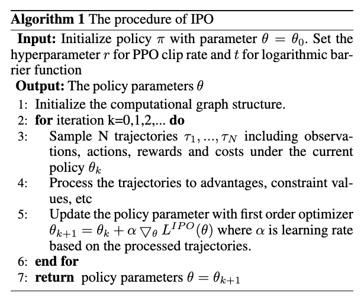

## The Purpose of This Study

현실 세계의 문제들은 long-term reward를 maximizing하면서, cumulative constraints를 만족해야 함

*논문에서는 두 가지 종류의 constraints(instantaneous, cumulative) 중 cumulative constraints에 초점*

이를 위해 본 논문에서는 구현하기 쉽고, 성능이 보장된 Interior-point policy optimization(first-order policy optimization method)을 제안

## Lit. Review

- Lagrangian relaxation method
	- Lagrange multiplier의 초기값에 민감
	- 학습 중에는 제약 조건을 일관되게 만족하지 못함
- Constrained policy optimization (CPO)
	- 제약 조건을 다루기 위해 TRPO를 확장
	- 학습 중에도 제약 조건 만족을 보장하나, second-order derivatives 계산이 필요하며 구현이 복잡
	- 여러 제약 조건을 다루기 어려움

## Methods

제약 조건을 반영하기 위해 objective function에 logarithmic barrier function을 페널티 함수로 추가
- 제약 조건이 만족될 경우, 보상 함수에 더해지는 페널티는 0 (policy optimization이 보상만 고려하도록)
- 제약 조건이 위반될 경우, 페널티는 음의 무한대로 발산 (제약 조건을 만족하도록 정책을 우선적으로 조정)

Problem definition
$$
\max_\theta L^{CLIP}(\theta), \; \text{s.t.} \; J^{\pi_\theta}_{C_i} \leq \epsilon_i
$$

^859e9e

constrained optimization problem [[#^859e9e]]을 아래 indicator function [[#^ec247d]]을 objective function에 추가함으로써 unconstrained problem으로 바꿀 수 있음

$$
\hat{J}^{\pi_\theta}_{C_i} = J^{\pi_\theta}_{C_i} - \epsilon_i
$$

$$
I(\hat{J}^{\pi_\theta}_{C_i}) =
\begin{cases}
0 &\quad \hat{J}^{\pi_\theta}_{C_i} \leq 0, \\
-\infty &\quad \hat{J}^{\pi_\theta}_{C_i} > 0
\end{cases}
$$

^ec247d

Indicator function은 미분 불가능하기 때문에 logarithm barrier function [[#^f24ad4]]을 사용하여 approximation ($t$는 하이퍼파라미터로 클수록 근사가 더 좋아짐)

$$
\phi(\hat{J}^{\pi_\theta}_{C_i}) = \frac{\log (-\hat{J}^{\pi_\theta}_{C_i})}{t}, \quad t > 0
$$

^f24ad4

따라서 objective function은 다음과 같이 정의됨

$$
\begin{gather}
\max_\theta L^{IPO}(\theta), \\
L^{IPO} = L^{CLIP}(\theta) + \sum_{i=1}^m \phi(\hat{J}^{\pi_\theta}_{C_i})
\end{gather}
$$

1. 제약 조건을 만족한 경우: $\hat{J}^{\pi_\theta}_{C_i} < 0 \Rightarrow \phi(\hat{J}^{\pi_\theta}_{C_i}) = \frac{\log (-\hat{J}^{\pi_\theta}_{C_i})}{t} >= 0$ ($t$가 커지면 0에 가까운 값이 됨)
2. 제약 조건을 위반한 경우: $\hat{J}^{\pi_\theta}_{C_i} > 0 \Rightarrow \phi(\hat{J}^{\pi_\theta}_{C_i}) = \frac{\log (-\hat{J}^{\pi_\theta}_{C_i})}{t}$ (log 안이 음수라 정의가 안됨)

## Results & Discussion

- 제약 조건을 위반하면 log 함수가 정의가 안되는데, 어떻게 처리한건지?

[omnisafe 구현](https://github.com/PKU-Alignment/omnisafe/blob/main/omnisafe/algorithms/on_policy/penalty_function/ipo.py#L45C5-L74C57)에서는 log 함수를 사용하는 게 아닌 logarithm barrier function의 기울기 스케일을 근사한 함수를 사용

$$
L = -\underset{s_t \sim \rho_{\theta}}{\mathbb{E}} \left[ \frac{\pi_{\theta}^{'} (a_t|s_t)}{\pi_{\theta} (a_t|s_t)} A (s_t, a_t) - \kappa \frac{J^{C}_{\pi_{\theta}} (s_t, a_t)}{C - J^{C}_{\pi_{\theta}} (s_t, a_t) + \epsilon} \right]
$$

## Critique
- Lagrangian relaxation, MDP, CDMP, policy gradient, TRPO, PPO에 대한 설명이 간결하게 잘 돼 있음
- Performance guarantee bound를 이론적으로 제공

- [ ] Performance guarantee bound, Experiments 읽기