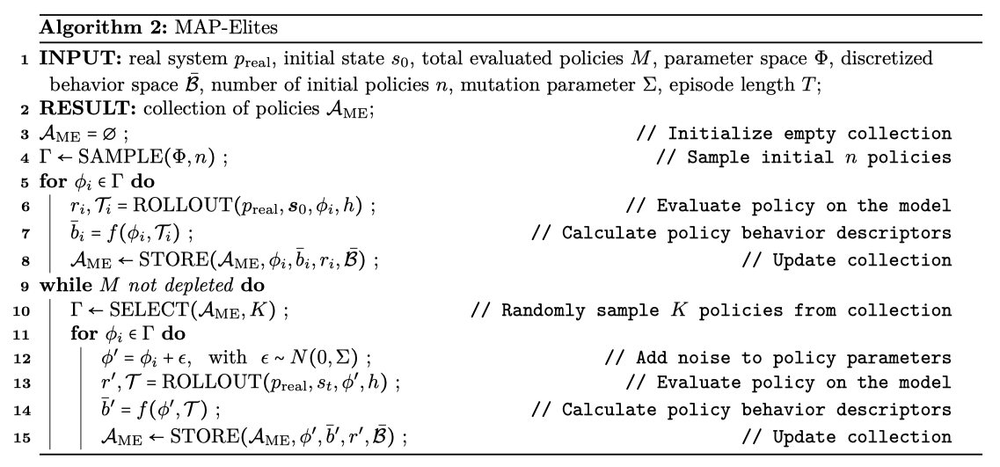
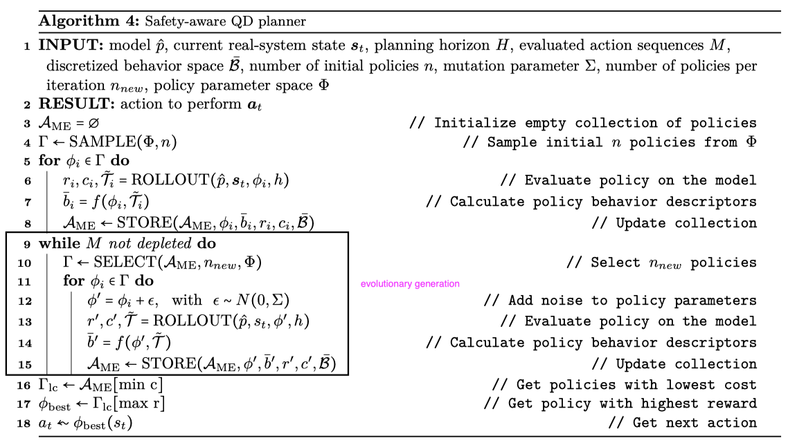

## The Purpose of This Study

RL에서는 탐험과 행동 실행에 있어서 시스템에 대한 제한 없는 접근이 필수적
=> 이에 따라, 바람직하지 않은 결과와 안전상의 위험을 초래할 수도 있음.

이러한 안전 위반은 통제된 환경에서의 학습 과정에서는 용인될 수 잇지만, 실제 배치(deployment) 단계에서는 안전한 작동을 보장하는 것이 중요함

기존 접근법들은 안정성 보장을 엄격하게 제한하기 때문에, 탐색이 제한되고 이로 인해 정책이 suboptimal로 수렴했다. (안정성 위반이 일부 허용되는 세팅에서도)

논문에서는 Evolution Algorithms의 일종인 Quality-Diversity 방법(그 중에서도 Map-Elites)을 planner로써 사용한 Model-Based RL 알고리즘을 제안한다.

## Lit. Review

- Model-free
[[📚 Improving safety in deep reinforcement learning using unsupervised action planning]]
safe replay buffer에다가 recovery actions(에이전트가 안전하지 않은 영역을 벗어날 수 있도록 하는 행동들)을 저장해놓고, 에이전트가 안전하지 않은 상태에 들어가면 유사한 transition을 찾아서 동일한 행동을 함으로써 위험한 상태를 탈출하도록 함.

- Model Predict Control

기존의 방법들은 CEM ([Uncertainty Guided Cross-Entropy Methods (CEM)](https://arxiv.org/abs/2111.04972))을 사용하여 objective function을 최대화하는 optimal parameters를 찾음

Quality Diversity (QD) Map-Elites 알고리즘은 다양하고 성능이 높은 해들을 다양하게 생성하도록 설계됨.

CEM은 단일 최적해에 집중하는 반면 QD Map-Elites 알고리즘은 폭 넓은 대안들을 제공

### 3. Backgorund

#### 3.3 Quality-Diversity and Map-Elites

Quality-Diversity 방법은 Evolution Algorithms의 일종으로, 다양한 행동을 하는 정책을 생성하면서 동시에 높은 성능을 달성하는 것을 목표로 한다.

각 정책은 시스템에서 실행되면 trajectory $\mathcal{T}_i$를 얻게 되는데, 이를 behavior function $f(\mathcal{T}_i) = b_i \in \mathcal{B}$을 사용하여 behavior descriptor $b_i$로 맵핑한다.

behavior space $\mathcal{B}$는 각 정책의 행동을 표현하기 위해 사람이 설계한 space로, 이 space 내에서 정책들 간의 거리를 극대화함으로써 다양한 정책 집합을 생성할 수 있다.

각 정책들은 보상을 기준으로 최적화된다.

##### 3.3.1 Map-Elites

논문에서는 QD를 단순화한 Map-Elites를 사용

behavior space $\mathcal{B}$를 grid로 discretized하고, 이 grid의 cell을 채우는 방식으로 최적 정책을 탐색

**Algorithm 2: MAP-Elites**

1. $\Gamma \leftarrow \text{SAMPLE}(\Phi, n)$: $n$개의 정책을 샘플링 (line 4)
2. 샘플링한 정책을 가지고 rollout한 다음(이때 실제 모델 $p_{\text{real}}$을 사용), 생성된 trajectories를 $\mathcal{A}_{\text{ME}}$에 저장. (line 5-8)
   STORE function (Algorithm 3: STORE function of MAP-Elites)
	1. trajectory를 discretized behavior descriptor $\bar{b}$로 변환
	2. $\mathcal{A}_{\text{ME}} = \mathcal{A}_{\text{ME}} \cup (\phi, \bar{b}, r)$: collection of policies $\mathcal{A}_{\text{ME}}$에 저장
3. 아래 과정을 $M$번 반복 ($M$: total evaluated policies)
	1. $\Gamma \leftarrow \text{SELECT}(\mathcal{A}_{\text{ME}}, K)$ (line 10): 저장된 정책 중 $K$개를 샘플링
	2. parameter에 noise를 추가한 다음 rollout 해서 trajectories를 생성
	3. STORE function

STORE function을 통해 각 셀에 behavior descriptor를 저장하는데, 이때 해당 셀에 이미 저장이 돼 있다면, 더 성능이 좋은 behavior descriptor를 저장
이 과정을 통해 저장된 정책들의 품질이 점진적으로 향상됨

## Methods

논문에서는 모델 학습을 위해 auto-regressive mixture density net을 사용 (에러 누적을 완화하는 특성을 갖고 있음)

Algorithm 2, 3은 논문에서 제안한 방법인 Algorithm 4, 5의 vanilla version

**Algorithm 4: Safety-aware QD planner**

1. $\mathcal{T} \leftarrow \text{SAMPLE}(\phi, n)$: n개의 정책을 샘플링 (line 4)
2. 샘플링한 정책을 가지고 rollout한 다음(이때 학습된 모델 $\hat{p}$을 사용), 생성된 trajectories를 $\mathcal{A}_{\text{ME}}$에 저장 (line 5-8)
   STORE function (Algorithm  5: STORE function of safety-aware planner)
	1. trajectory를 discretized behavior descriptor $\bar{b}$로 변환
	2. $\mathcal{A}_{\text{ME}} = \mathcal{A}_{\text{ME}} \cup (\phi, \bar{b}, r)$: collection of policies $\mathcal{A}_{\text{ME}}$에 저장
	3. 이때 vanilla ME STORE function(Algorithm 3)과는 다르게, 저장시에 cost까지 고려함. (그래서 다음 action을 생성할 때 cost가 낮은 행동을 선택할 수 있음)
3. 아래 과정을 M번 반복 (M: evaluated action sequences) - 여기가 evolutionary generations (line 9-15)
	1. SELECT funtion (Algorithm 6: SELECT function of safety-aware planner): vanilla ME(알고리즘 2)와는 다름
		1. $\Gamma \leftarrow \text{SELECT}(\mathcal{A}_{\text{ME}}, n_{\text{new}},\phi)$: $n_{\text{new}}$개의 정책을 선택
		2. 개수가 부족하면 무작위 정책을 추가로 샘플링 (exploration을 강화)
	2. 선택된 정책($\Gamma$)의 파라미터 $\phi$에다가 Gaussian noise $\epsilon$로 perturbed
	3. 선택된 정책($\Gamma$)으로 다시 rollout해서 trajectories를 생성
	4. STORE function (Algorithm 5)
4. $A_{\text{ME}}$에 저장된 행동 중 가장 좋은 행동 $a_t$를 선택하여 실행

## Results & Discussion

## Critique

실행 시간에 관한 언급이 없음