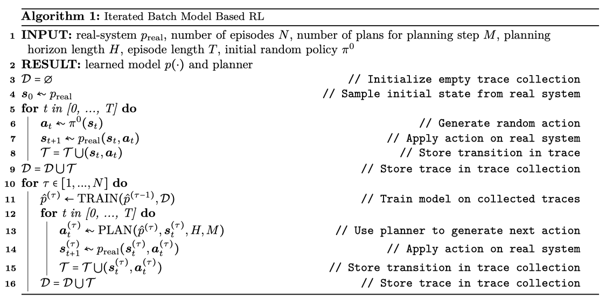
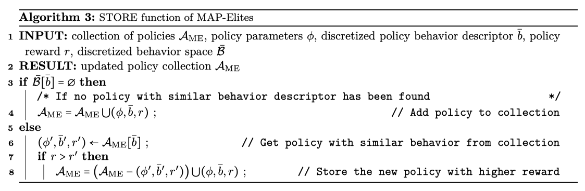
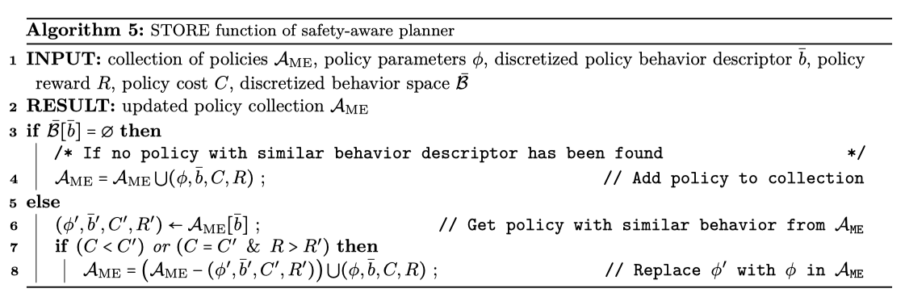
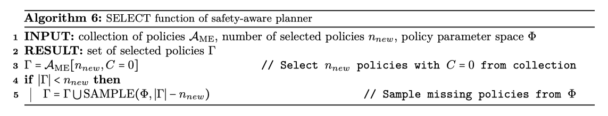
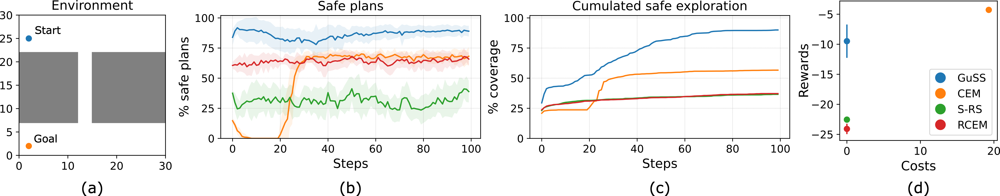

## The Purpose of This Study

### Abstract

Existing approaches that enforce strict safety guarantees can limit exploration and lead to suboptimal policies in settings where some safety violations are tolerated.

In this paper, we propose Guided Safe Shooting (GuSS), a Model-Based RL (MBRL) approach that leverages a Quality-Diversity (QD) algorithm as a planner with a soft safety objective.

GuSS is the first MBRL approach that combines QD and safety objectives in a principled way.

### Introduction

RL necessitates unrestricted access to the system for both exploration and action execution, potentially leading to undesirable outcomes and safety risks.

While such safety violations can be tolerated during training in controlled settings, ensuring safe operation during deployment is crucial.

Addressing this issue, known as *safe exploration*, is a central problem in AI safety ([[📝 Safe learning in robotics (From learning-based control to safe reinforcement learning)]])and is the focus of our research.

In many engineering settings, safety constraints are often defined on two levels
- The hard constraints protect the system from serious damage and are usually enforced by emergence shutdown, which we call a "red-button" scenario.
- The soft constraints are allowed, even more so at training time, it is important to keep the number of violations as low as possible.

Most existing safe-RL approaches tend to strictly enforce any safety constraint, whether hard or soft.
While this is useful for critical situations, it can be limiting in the presence of soft-constraints as it can lead to over-cautious solutions that limit exploration and performance.

We propose Guided Safe Shooting (GuSS) a novel method that combines QD algorithms with Model-Based RL (MBRL) in the context of soft safety constraints.

## Lit. Review

### 2. Related Work

- Model-free RL methods
A different strategy involves storing all the "recovery" actions that the agent took to leave unsafe regions in a separate replay buffer ([[📚 Improving safety in deep reinforcement learning using unsupervised action planning]]).

This buffer is then used whenever the agent enters an unsafe state by selecting the most similar transition in the safe replay buffer and performing the same action to escape the unsafe state.

- Model-based RL methods

**Gaussian Processes**
A common approach is to rely on Gaussian Processes (GPs) to model the environment and use the dynamics model's uncertainty to guarantee safe exploration.

While GPs allow for good representation of the dynamics uncertainty, their usability is limited to low-data, low-dimensional regimes networks.

**Ensemble Networks**
A common alternative to GPs is the use of ensemble networks which scale better.

In our work, we use the MBRL setup and choose to use auto-regressive mixture density net as model which have shown to alleviates error accumulation down the horizon which is an important feature for planning.

**Model Predictive Control**

A different approach adopted in the control community is to rely on Model Predictive Control (MPC) to select the safest trajectories with a learned or given model in closed-loop fashion.

The authors of [Uncertainty Guided Cross-Entropy Methods (CEM)](https://arxiv.org/abs/2111.04972) extends [[🇺🇸 Deep Reinforcement Learning in a Handful of Trials using Probabilistic Dynamics Models]] by modifying the objective function of the CEM-based planner to avoid unsafe areas.
In this setting, an unsafe area is defined as the set of states for which the ensemble of models has the highest uncertainty.

While the Cross-Entropy Method (CEM) is designed to identify the optimal parameters that maximize a specific objective function, the Quality Diversity (QD) Map-Elites algorithm is design to generate a wide array of diverse and high-performing solutions.

The advantage of using QD Map-Elites algorithm in generating safe plans is its ability to produce a diverse set of solutions, thereby offering a wider spectrum of safe alternatives rather than concentrating on a singular optimal solution like CEM.

### 3. Background

#### 3.2 MBRL with decision-time planning

In this work, we address safety using an MBRL approach with decision-time planning, also known as Model Predictive Control (MPC).

This approach approximates the problem in $\pi^* = \arg \max_{\pi \in |pi_C}\{\text{MR}(\tau)\}$ by repeatedly solving a simplified version of the problem initialized at the currently measured state $s_t$ over a shorter horizon $H$ in a receding horizon fashion. (MPC scheme relies on a sufficiently descriptive transition dynamics)

In this work, we consider iterated batch MBRL(growing batch or semi-batch). 

Algorithm 1 starts with an initial random policy $\pi^{(0)}$.
Then, in an iteration over $\tau = 1, \ldots, N$, it updates the model $\hat{p}^{(\tau)}$ in a two-step process of 
(i) performing MPC on the real system $p_{\text{real}}$ for a whole episode to obtain the trace $\mathcal{T}^{(\tau)} = \left((s^{(\tau)}_1, a^{(\tau)}_1), \ldots (s^{(\tau)}_T, a^{(\tau)}_T) \right)$
(ii) training the model $\hat{p}^{(\tau))}$ on the growing collection of transition data $D = \cup^\tau_{\tau' = 1} \mathcal{T}^{(\tau')}$ collected up to iteration $\tau$.

The process is repeated until a given number of evaluations $N$ or a target performance are reached.

#### 3.3 Quality-Diversity and Map-Elites

Quality-Diversity methods belong to the family of Evolution Algorithms (EAs) and are designed to achieve two goals simultaneously: generating policies that exhibit diverse behaviors and achieving high performance.

Each policy is executed on the system, resulting in a trajectory $\mathcal{T}_i$ 

The trajectory is then mapped to a behavior descriptor $b_i \in \mathcal{B}$ through an associated behavior function: $f(\mathcal{T}_i) = b_i \in \mathcal{B}$.

The space $\mathcal{B}$ is a hand-designed space in which the behavior of each policy is represented.

By maximizing the distance of the policies in this space, QD methods can generate a collection of highly diverse policies. (Note that the choice of $\mathcal{B}$ is fundamental and is dependent both on the environment and on the kind of task the agent has to solve in the environment.)

The policies discovered during the search are then optimized with respect to the reward according to the reward according to different strategies depending on the algorithm1.png

##### 3.3.1 Map-Elites

In this work, we select the [MAP-Elites (ME) algorithm](https://arxiv.org/abs/1504.04909) from the range of QD methods due to its simplicity and effectiveness.

MAP-Elites (ME) operates by discretizing the behavior space $\mathcal{B}$ into a grid $\bar{\mathcal{B}}$ and searching for the best policies whose discretized behaviors fill up the cells of the grid.

The algorithm starts by sampling the parameters $\phi \in \Phi$ of $n$ policies from a random distribution and evaluating them in the environment.

The behavior descriptor $b_i \in \mathcal{B}$ of a policy $\phi_i$ is then calculated from the trace $\mathcal{T}_i$ generated during the policy evaluation.

This descriptor is then assigned to the corresponding cell in the discretized behavior space.

- If no other policy with the same behavior descriptor has been discovered previously, $\phi_i$ is stored as part of the collection of policies $\mathcal{A}_{\text{ME}}$ returned by the method.
- If another policy with the similar discretized descriptor is already present in the collection, only the one with the highest reward is kept.

This operation is performed by the STORE function shown in Alg. 3 and allows the gradual increase of the quality of the policies stored in $\mathcal{A}_{\text{ME}}$.

At this point, ME randomly samples a policy from the collection, and uses it to generate a new policy $\tilde{\phi}_i$ to evaluate by adding random noise to its parameters.

The cycle repeats until the given evaluation budget $M$ is depleted.

### 4. Guided safe shooting

#### 4.1 The learned system model

As model class we use auto-regressive (DARMDN) and non auto-regressive mixture density nets (DMDN), that have recently been used in multiple works.

Both are neural nets, outputting parameters of Gaussian distributions, conditioned on the previous state and action.

- DARMDN
We learn $d_s$ auto-regressive deep neural nets, where $p_0(s^0_{t + 1}|s_t, a_t)$ and $p_l(s^l_{t + 1} | s^0_{t + 1}, \ldots, s^{l-1}_{t + 1}, s_t, a_t), l = 1, \ldots, d_{s - 1}$ outputting a scalar mean and standard deviation for each dimension of the state vector.

- DARMDN
DMDN learns a single spherical $d_s$-dimensional Gaussian, outputting a mean vector and a standard deviation vector.

We choose DARMDN for smaller dimensional systems and DMDN for SafeCar-Goal.

The models are trained by optimizing the negative log likelihood loss:
$$
\mathcal{L} = \mathbb{E}_{s, a, s' \sim \tau} \{-\log \mathcal{N}(s';s + \mu_\theta, \sum(s, a))\}
$$

## Methods

### 4. Guided safe shooting

#### 4.2 Model-based safe quality-diversity

The main contribution of this paper is the application of QD as a planner for a MBRL algorithm in the context of safe-RL with soft safety constraints.

In our case, these policies are represented by neural networks with random weights.

**lines 3-8**

These policies are evaluated on the learned model $\hat{p}$ for a duration of $H$ timesteps, starting from the current state of the real system $s_t$.

To map the trace to the policy's discretized behavior descriptor, we employ a hand-designed, environment-specific behavior function $f(\cdot)$, resulting in the discretized representation $\bar{b}_i \in \bar{\mathcal{B}}$.

Finally, the evaluated policies are stored in the collection $A_{\text{ME}}$ through the STORE function (Algorithm 5).

Contrary to the vanilla ME STORE function (Algorithm 3), it is here that the policies' safety comes into play in the evaluation.
- When a policy $\phi_i$ with a unique discrete behavior descriptor is encountered, the tuple $(\phi_i, \bar{b}_i, c_i, r_i)$ is directly added to the collection.
- If another policy $\phi_j$ with $\bar{b}_j = \bar{b}_i$ already exists in the collection, only the better of the two policies is retained. ("better policy" refers to the one with the lowest cost. If they have same cost, the one with the highest reward is kept.)

**lines 9-15**

The planner then starts an iteration of multiple evolutionary generations until a total of $M$ planning policies have been evaluated.

In each generation, a pool $\Gamma$ of $n_{\text{new}}$ policies with cost $c = 0$ are uniformly sampled from $\mathcal{A}_{\text{ME}}$ through the SELECT function (Algorithm 6).

If not enough policies with zero cost are present in the collection, additional policies with random weights are included in $\Gamma$ until its size matches $n_{\text{new}}$. (It facilitates increased exploration.)

The parameters of the policies in $\Gamma$ are then perturbed by adding Gaussian noise $\epsilon \sim N(0, \sum)$ to generate new policy parameters, denoted as $\phi' = \phi_i + \epsilon$. (**line 12 Alg 4**)

The new policies are evaluated on the model an stored in the collection using the STORE function (**lines 11-15 Alg 4**).

The genetic perturbation and selection of the policies allows to continually refine the collection until a total of $M$ policies have been evaluated.

Among these policies, the one with the highest reward is chosen as the final policy to generate the next action for application on the real system, i.e., $a_t = \phi_{\text{best}}(s_t)$ (**lines 16-18 Alg 4**)

## Results & Discussion

### 5. Experiments

#### 5.1 Safe exploration with known model of environment

We compare our method against three other planners: CEM, RCEM, and Safe Random Shooting (S-RS).

The agent must move from Start to the Goal by observing its current position, and performing actions, which control the $(x, y)$ movement at the next time step.

The behavior space used by GuSS is the plans' final $(x, y)$ position.

To decouple the performance of the planners from the performance of the model, we perform no model learning and instead use a perfect model to evaluate the plans.

The exploration is evaluated as the percentage of safe plans generated at each step (Fig. 2.(b)) and the amount of safe space covered by the generated safe plans (Fig. 2.(c)).
	
This last metric is calculated by dividing the space into a $50 \times 50$ grid and counting the percentage of cells in the safe space visited by safe plans.

#### 5.2 Safe exploration with world model learning

We evaluated the performance of GuSS on three different OpenAI gym environments with safety constraints: pendulum swing-up, Acrobot with discrete actions and SafeCar-Goal from the safety-gym environment.

We compared GuSS against various baselines to determine how much different the performance of safe MPC methods are in comparison to unsafe ones.

We compared against [[📚 Neural network dynamics for Model-Based Deep Reinforcement Learning with Model-Free Fine-Tuning]], [[🇺🇸 Deep Reinforcement Learning in a Handful of Trials using Probabilistic Dynamics Models]], and two recent safe MBRL approaches: [[📚 Safe Reinforcement Learning by Imagining the Near Future]], [Constrained Model-based Reinforcement Learning with Robust Cross-Entropy Method](https://arxiv.org/abs/2010.07968).

Additionally, to demonstrate the sample efficiency of model-based approaches, we compared against two safe model-free baselines: [[📚 Constrained Policy Optimization]], PPO Lagrangian.

### 6. Conclusion and Future work

In this study, we proposed GuSS, the first model based planning method using quality-diversity methods for safe reinforcement learning.

In conclusion, Guided Safe Shooting (GuSS), demonstrates promising results in balancing performance and cost in safety-critical reinforcement learning environments.

However, the performance of GuSS is dependent on the accuracy of the model used.

If the model is wrong, it could easily lead the agent to unsafe states.

in future work, we will work on incorporating model uncertainty with QD to inform the agent about the risk of its actions to reduce unsafe behavior during the model learning phase.

Additionally, the need to hand-design the behavior space in QD-based algorithms limits the range of applicability. (How to to autonomously build such space still remains an open question.)

## Critique