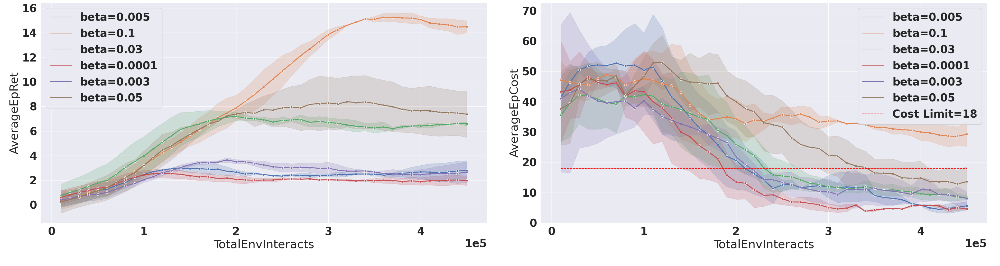
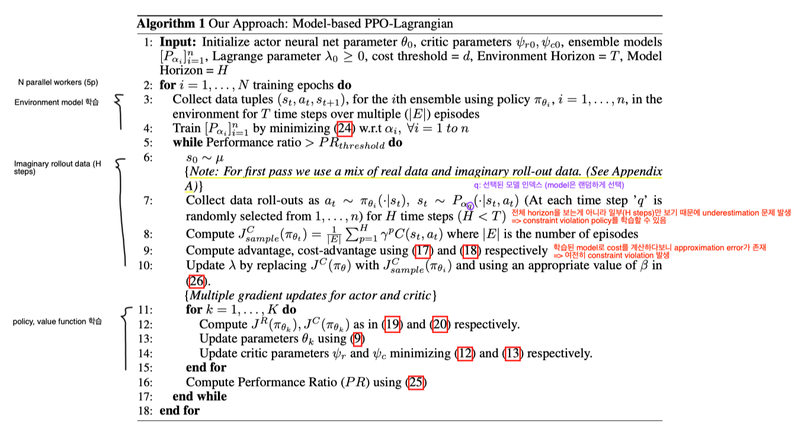

## The Purpose of This Study

On-Policy Model-based Safe Deep RL 알고리즘을 제안

transition dynamics를 학습하고, Lagrangian Relaxation 기반 PPO를 사용하여, online으로 최적의 정책을 찾음.

NN의 앙상블을 사용하여 aleatoric, epistemic uncertainty를 다룸.

기존 Constrained RL에서의 model-free 알고리즘들은 샘플 효율성(environment interaction)이 낮았음. (즉, 수렴하기 위해 환경과의 상호작용이 많이 필요)

저자는 샘플 효율적인 model-based constrained RL 기반 방법을 제안

## Lit. Review

- Model-free

[[Paper-Reviews/Constrained RL/Constrained Policy Optimization/Review|Review]]은 trust region based constrained optimization 프레임워크를 제안, surrogate functions(objective와 constraint에 관련된)을 사용하여 근사한 뒤 projection 단계를 통해 제약 조건 위반을 조정

- Model-based

[Safe Reinforcement Learning by Imagining the Near Future](https://arxiv.org/abs/2202.07789)에서는 cost function을 사용하는 대신, reward functions을 통해 페널티를 주는 방식으로 환경의 모델을 학습하여 SAC 알고리즘으로 정책을 최적화.

## Methods

### Model-based Constrained RL

$$
\max_{\pi_\theta \in \Pi_\theta} J^R_m(\pi_\theta) \; \text{s.t.} \; J^C_m(\pi_\theta) \leq d
\tag{21}
$$
$$
J^R_m(\pi_\theta) = \mathbb{E} \left[\sum^\infty_{t = 0} \gamma^t R(s_t, a_t, s_{t + 1} | s_0 \sim \mu, s_{t + 1} \sim P_\alpha(\cdot|s_t, a_t), a_t \sim \pi_\theta, \forall t) \right]
\tag{22}
$$
$$
J^C_m(\pi_\theta) = \mathbb{E} \left[\sum^\infty_{t = 0} \gamma^t C(s_t, a_t, s_{t + 1}) |s_0 \sim \mu, s_{t + 1} \sim P_\alpha(\cdot|s_t, a_t), a_t \sim \pi_\theta, \forall t \right]
\tag{23}
$$

여기서 $P_\alpha(\cdot|s_t, a_t)$는 $\alpha$로 parameterized 된 환경 모델로, 초기 상태 $s_0$만 실제 initial state distribution $\mu$로부터 샘플링되고, 이후로는 학습된 모델로부터 샘플링 된다고 가정 $s_{t + 1} \sim P_\alpha(\cdot|s_t, a_t), \forall > 0$. (Imaginary roll-outs *보상, 비용을 모두 모델로 예측해서 사용*)

### Challenges in Environment Model Learning

#### Handling aleatoric and epistemic uncertainty

- Aleatoric uncertainty

시스템의 본질적인 랜덤성으로 나타나는 불확실성으로 실험 결과의 변동성을 만듦.
이러한 불확실성은 줄일 수 없는(irreducible) 특성이다.
따라서 이러한 경우에는 모델의 예측을 통해 불확실성을 측정하는 것이 바람직하다.

- Epistemic uncertainty

모델이 충분한 지식을 갖지 못해 일반화 성능이 떨어지는 현상을 의미

*일반적인 single NN은 데이터가 부족해서 일반화 성능이 떨어질 때도 자신있게 출력을 내놓음*
*하지만 여러 개의 NN을 다른 데이터셋으로 학습하면, 데이터가 충분한 구간에서는 모든 네트워크가 비슷한 출력을 냄 (epistemic uncertainty가 작음), 반면 부족한 구간은 불일치(disagreement)로 epistemic uncertainty가 커짐*

#### Aggregation of Error

Model-based RL에서는 horizon에 따라 이동하는데, 에러가 누적되면 실제 모델로부터 발산하는 경향이 있음.

이러한 문제를 다루기 위해 대부분의 모델 기반 방법들은 짧은 horizon을 사용하거나, truncated 한다.

논문에서는 truncated를 사용했다.

#### Implication of using truncated horizon in Constrained RL

truncated horizon을 사용할 경우 cost returns을 underestimation하는 문제가 발생

이로 인해 실제 환경에서는 constraint violation이 발생할 수도 있음.

=> 따라서 safety threshold $d$를 더욱 엄격하게 설정

hyperparameter $0 \leq \beta < 1$로 Lagrange multiplier 업데이트를 수정
$$
\lambda_n = [\lambda_n - \eta_2(n)(J^C(\pi_\theta) - d * \beta)]_+
$$

$\beta$에 따른 에피소드별 reward, cost 값

### 3.3 Model-based PPO Lagrangian

[[Paper-Reviews/Constrained RL/Safe Model-Based Reinforcement Learning with Robust Cross-Entropy Method/Review|Review]]에서처럼 pseudo-lidar 대신 상대 좌표를 observation으로 사용 

실제 환경과의 상호작용 없이 정책을 정확하게 평가하는 것은 어려움

Ensemble model의 Performance Ratio (PR)를 측정 ([Model-ensemble trust-region policy optimization](https://arxiv.org/abs/1802.10592)에서 제안한 방법)

$$
\text{PR} = \frac{1}{n} \sum^n_{i = 1} \mathbb{1}(\zeta^R(\alpha_i, \theta_t) > \zeta^R(\alpha_i, \theta_{t - 1}))
$$
where $\zeta^R(\alpha_i, \theta_t) = \sum^T_{t = 0} \gamma^t R(s_t, a_t, s_{t + 1}), s_0 \sim \mu$ and $\forall t \geq 0 : s_{t + 1} \sim P_{\alpha_i}(\cdot|s_t, a_t), a_t \sim \pi_{\theta_t}(\cdot|s_t)$ 

PR은 정책의 성능이 향상된 모델의 비율($n$: ensemble model의 개수)을 나타낸다.

이 값이 $\text{PR}_\text{threshold}$ 보다 높으면 계속해서 학습을 진행하고, 그렇지 않으면 환경 모델을 다시 학습한다.

## Results & Discussion

모델 기반 방법에서 어려운 부분은 환경 모델을 학습하는 것
1. 계산 자원과 시간 오버헤드 (제안 방법이 실행 시간 측면에서 safe-LOOP보다 훨씬 낫다고 함)
2. safe exploration 환경에서는 unconstrained agent처럼 충분히 탐험하지 않아서, 모델 학습이 더 어려워짐 (이런 현상은 DoggoGoal1 같은 고차원 환경에서 두드러지게 나타났다고 함)

**Future works**

- Lagrangian 기반 방법들의 보상 성능 향상
- 탐색이 제한되는 high-dimensional state representation에서 더 나은 모델 학습 방법 고안
- Constrained MDP 환경에서 off-policy actor-critic 알고리즘을 적용하고 성능을 이론적·실험적으로 연구

## Critique

Lagrangian Relaxation (PPO Lagrangian), Generalized Advantage Estimation, Uncertainty에 대한 설명이 잘 돼 있음.

[[Paper-Reviews/Constrained RL/Safe Model-Based Reinforcement Learning with Robust Cross-Entropy Method/Review|Review]] 이 논문에서 사용한 Safety Gym 환경에서 테스트를 했는데, 왜 model-based 비교군으로는 다른 방법 [safe-LOOP](https://arxiv.org/abs/2008.10066)로만 비교했는지? 둘 다 2021년에 나온 논문인데? 성능 때문인가?
