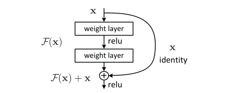

## Skip-connection

[ResNet](https://arxiv.org/abs/1512.03385)에서 제안한 방법으로, 네트워크 사이의 입력과 출력의 변화가 크지 않을 것이라는 가정에서 시작($\mathbf{x} \approx \mathcal{H}\mathbf{x}$)

hidden layer의 입력 $\mathbf{x}$와 다음 hidden layer의 출력 $F(\mathbf{x})$

- skip-connection을 사용하지 않는 경우: $F(\mathbf{x}) \rightarrow \mathcal{H}(\mathbf{x})$로 만들기 위해서는 네트워크 가중치가 identity matrix가 되어야 함. (보통 가중치의 초기화가 0 근처로 이루어지므로, 이를 만들기는 어려움)
- skip-connection을 사용하는 경우: $\mathbf{x} + F(\mathbf{x}) \rightarrow \mathcal{H}(\mathbf{x})$로 만들기 위해서는 영행렬로 만들면 되므로, 이를 만들기는 상대적으로 쉬움

즉, 네트워크는 입력과 출력 사이의 차이(잔차: residual)만 학습하면 됨.

이를 residual learning이라고 한다.

> 입력과 출력이 같다는 것($F(\mathbf{x}) = 0$)은 학습을 진행하지 못하는 상태 아닌가?
> 
> 일반적인 딥러닝 모델에서는 각 layer를 통과할 때 입력 데이터에 대한 변환을 수행하고, 이를 다음 layer로 전달하는데 네트워크가 깊을 때는 모델이 특정 입력에 대한 원래의 정보를 유지하는 것이 유용
> 
> 이는 네트워크가 필요한 경우에만 변환을 수행하고, 그렇지 않을 경우 입력을 그대로 전달하여 정보를 보존할 수 있도록 함.

참고자료
- 혁펜하임 유튜브: https://youtu.be/Fypk0ec32BU?si=4Sfwp76FSXeHSJRn

**논문에서 layer가 2개 밖에 안되는데 skip-connection을 사용한 이유?**

1. LSTM이 잘 학습되지 않거나, 초기 학습 단계에서 맥락 정보를 잘 못잡을 때, MLP 출력을 그대로 더해주면 입력 특징이 그대로 남아있어 안정적인 학습이 가능
2. MLP 출력은 observation 기반의 즉각적인 정보, LSTM의 출력은 시간적 맥락을 반영한 정보니까 이 둘을 합침으로써 현재 상태와 과거 맥락을 함께 사용할 수 있음