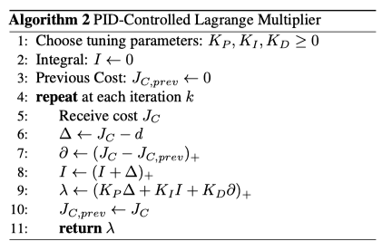

## Environment

- observation에 cost를 추가함

`_obs_prev_cost=True (default)`

```python title:"SafetyGymWrapper.observation()" ref:https://github.com/astooke/rlpyt/blob/master/rlpyt/projects/safe/safety_gym_env.py#L85C5-L100C19
def observation(self, obs):
	if isinstance(obs, dict):  # and "vision" in obs:
		# flatten everything else than vision.
		obs_ = dict(
			prop=np.concatenate([obs[k].reshape(-1)
				for k in self._prop_keys])
		)
		if "vision" in obs:
			# [H,W,C] --> [C,H,W]
			obs_["vision"] = np.transpose(obs["vision"], (2, 0, 1))
		if self._obs_prev_cost:
			obs_["prop"] = np.append(obs_["prop"], self._prev_cost)
		obs = obs_
	elif self._obs_prev_cost:
		obs = np.append(obs, self._prev_cost)
	return obs
```


## Network

- observation에 normalization 적용: `normalize_observation=True (default)`
- skip-connection을 적용: `_lstm_skip=True (default)`

```python title:"CppoModel.forward()" ref:https://github.com/astooke/rlpyt/blob/master/rlpyt/projects/safe/cppo_model.py#L75C5-L117C23
def forward(self, observation, prev_action, prev_reward, init_rnn_state=None):
	lead_dim, T, B, _ = infer_leading_dims(observation, self._obs_ndim)
	if self.normalize_observation:
		obs_var = self.obs_rms.var
		if self.var_clip is not None:
			obs_var = torch.clamp(obs_var, min=self.var_clip)
		observation = torch.clamp((observation - self.obs_rms.mean) /
			obs_var.sqrt(), -10, 10)
	fc_x = self.body(observation.view(T * B, -1))
	if self.lstm is not None:
		lstm_inputs = [fc_x, prev_action, prev_reward]
		lstm_input = torch.cat([x.view(T, B, -1) for x in lstm_inputs],
			dim=2)
		# lstm_input = torch.cat([
		#     fc_x.view(T, B, -1),
		#     prev_action.view(T, B, -1),
		#     prev_reward.view(T, B, -1),
		#     ], dim=2)
		init_rnn_state = None if init_rnn_state is None else tuple(init_rnn_state)
		lstm_out, (hn, cn) = self.lstm(lstm_input, init_rnn_state)
		lstm_out = lstm_out.view(T * B, -1)
		if self._lstm_skip:
			fc_x = fc_x + lstm_out
		else:
			fc_x = lstm_out
	
	mu = self.mu(fc_x)
	log_std = self.log_std.repeat(T * B, 1)
	v = self.value(fc_x).squeeze(-1)
	mu, log_std, v = restore_leading_dims((mu, log_std, v), lead_dim, T, B)
	
	if self.constraint is None:
		value = ValueInfo(value=v, c_value=None)
	else:
		c = self.constraint(fc_x).squeeze(-1)
		c = restore_leading_dims(c, lead_dim, T, B)
		value = ValueInfo(value=v, c_value=c)
	
	outputs = (mu, log_std, value)
	if self.lstm is not None:
		outputs += (RnnState(h=hn, c=cn),)
	
	return outputs
```


cf) forward() 차원 처리: T, B를 미리 파악해놓고 이를 바탕으로 reshape해서 사용

```python
def infer_leading_dims(tensor, dim):
    lead_dim = tensor.dim() - dim
    assert lead_dim in (0, 1, 2)
    if lead_dim == 2:  # tensor: (seq, batch, hid)
        T, B = tensor.shape[:2]
    else:
        T = 1
        B = 1 if lead_dim == 0 else tensor.shape[0]  # if: (1, 1, hid), else: (1, batch, hid)
    shape = tensor.shape[lead_dim:]
    return lead_dim, T, B, shape
```

- [x] [PPO LSTM](https://github.com/seungeunrho/minimalRL/blob/master/ppo-lstm.py) 코드 분석 → [[LSTM Data Processing]]

## Training

[[Review#7. Reward-Scale Invariance]]

- scaling factor $\beta_\nabla$를 사용하여 reward와 cost의 스케일을 맞춤

```python title:CppoPID.compute_beta_grad() ref:https://github.com/astooke/rlpyt/blob/master/rlpyt/projects/safe/cppo_pid.py#L522C5-L543C55
def compute_beta_grad(self, loss_inputs, init_rnn_state):
	"""Ratio of KL grad-norms from reward vs cost objectives."""
	# Assume minibatches=1.
	self.optimizer.zero_grad()
	
	r_loss, c_loss = self.beta_grad_losses(*loss_inputs, init_rnn_state)
	
	r_loss.backward(retain_graph=True)
	r_grad_norm = torch.nn.utils.clip_grad_norm_(
		self.agent.parameters(), self.clip_grad_norm)
	r_grad_norm = min(r_grad_norm, self.clip_grad_norm)
	self.optimizer.zero_grad()
	c_loss.backward()
	c_grad_norm = torch.nn.utils.clip_grad_norm_(
		self.agent.parameters(), self.clip_grad_norm)
	c_grad_norm = min(c_grad_norm, self.clip_grad_norm)
	self.optimizer.zero_grad()
	
	if self._ddp:
		raise NotImplementedError
	
	return float(r_grad_norm) / float(c_grad_norm)
```


[CppoPID.optimize_agent()](https://github.com/astooke/rlpyt/blob/master/rlpyt/projects/safe/cppo_pid.py#L132C5-L249C24)

- PID 제어로 $\lambda$(`cost_penalty`) 업데이트



```python
# PID update here:
delta = float(ep_cost_avg - self.cost_limit)  # ep_cost_avg: tensor
self.pid_i = max(0., self.pid_i + delta * self.pid_Ki)
if self.diff_norm:
	self.pid_i = max(0., min(1., self.pid_i))
a_p = self.pid_delta_p_ema_alpha
self._delta_p *= a_p
self._delta_p += (1 - a_p) * delta
a_d = self.pid_delta_d_ema_alpha
self._cost_d *= a_d
self._cost_d += (1 - a_d) * float(ep_cost_avg)
pid_d = max(0., self._cost_d - self.cost_ds[0])
pid_o = (self.pid_Kp * self._delta_p + self.pid_i +
	self.pid_Kd * pid_d)
self.cost_penalty = max(0., pid_o)
```


- [CppoPID.loss()](https://github.com/astooke/rlpyt/blob/master/rlpyt/projects/safe/cppo_pid.py#L251C5-L327C73)에서 policy, value function loss 계산

```python
for _ in range(self.epochs):
	for idxs in iterate_mb_idxs(batch_size, mb_size, shuffle=True):
		T_idxs = slice(None) if recurrent else idxs % T
		B_idxs = idxs if recurrent else idxs // T
		self.optimizer.zero_grad()
		rnn_state = init_rnn_state[B_idxs] if recurrent else None
		# NOTE: if not recurrent, will lose leading T dim, should be OK.
		loss, entropy, perplexity, value_errors, abs_value_errors = self.loss(
			*loss_inputs[T_idxs, B_idxs], rnn_state)
		loss.backward()
		grad_norm = torch.nn.utils.clip_grad_norm_(
			self.agent.parameters(), self.clip_grad_norm)
		self.optimizer.step()
```