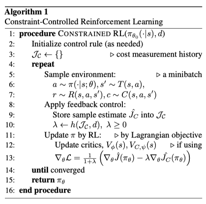
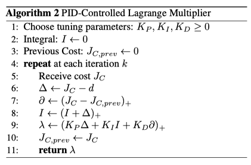
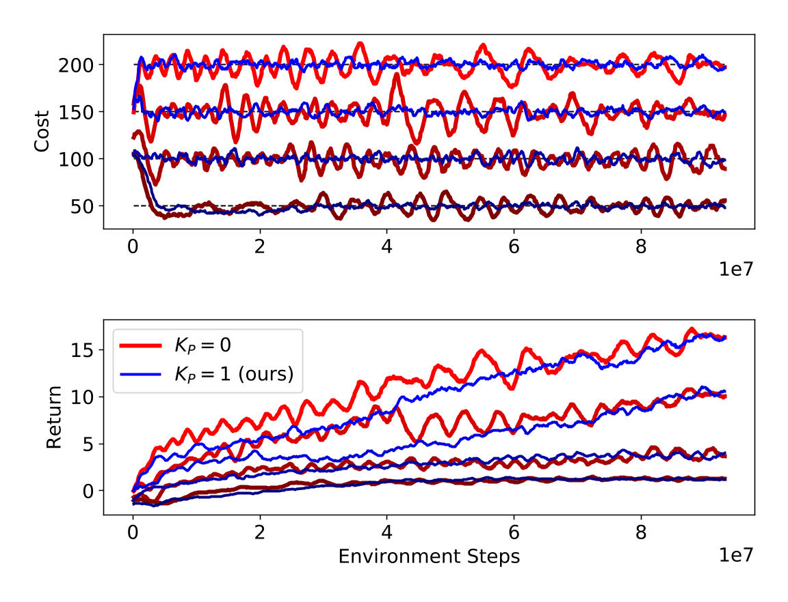
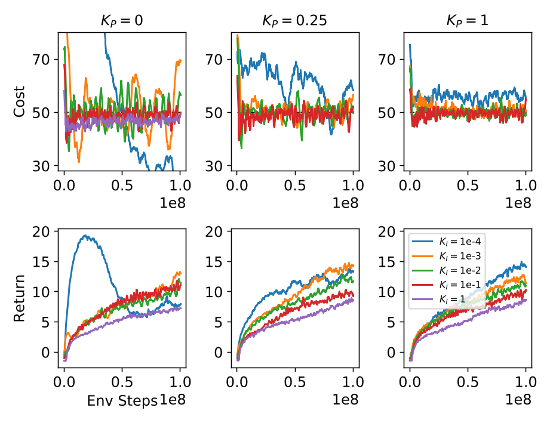
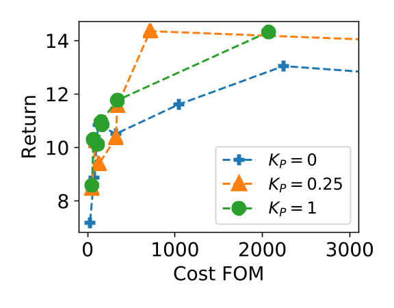
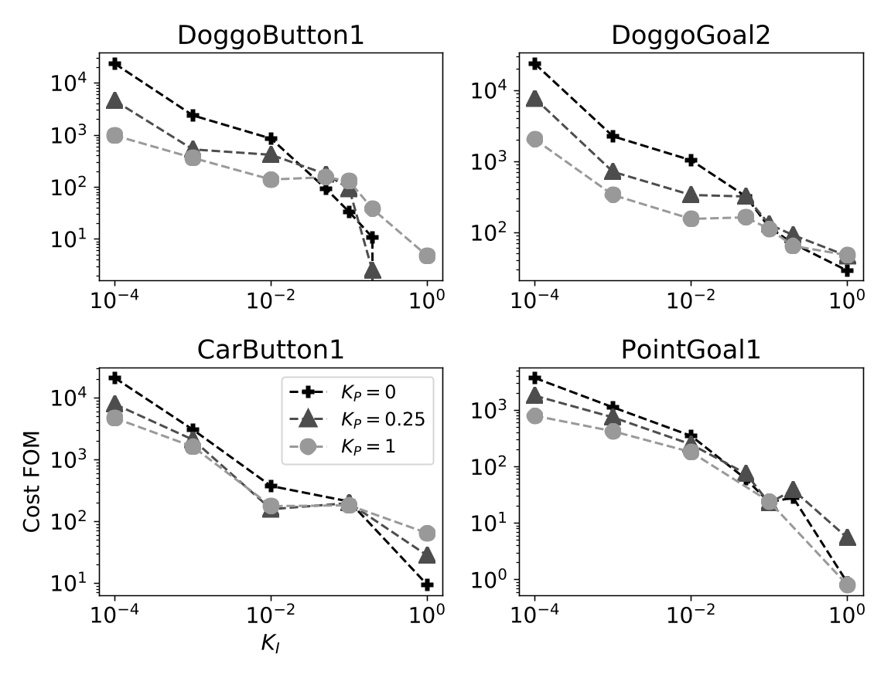
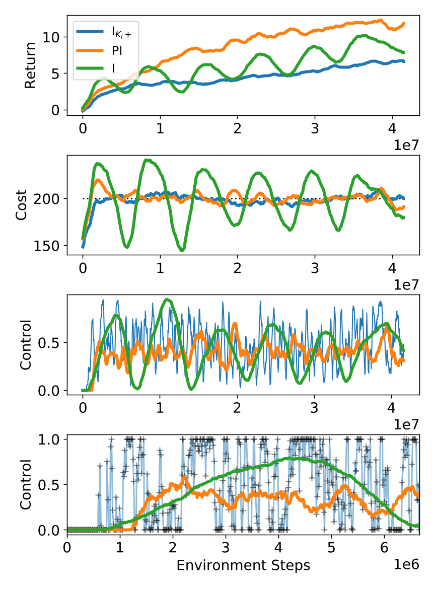
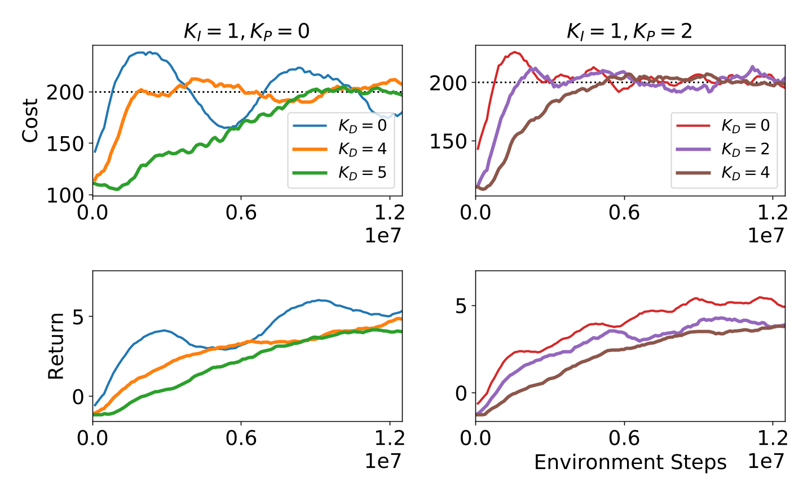
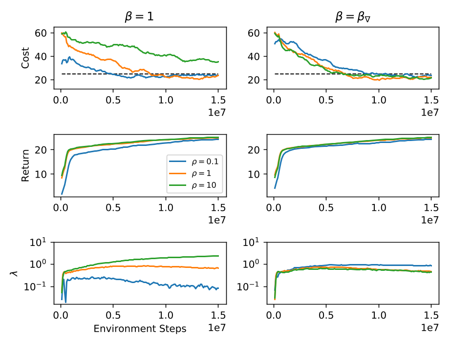

## The Purpose of This Study

Lagragne multiplier는 integral control로 업데이트 되기 때문에(제어 이론 관점에서), oscillation·overshoot이 발생

## Methods

### 5. Feedback Control for Constrained RL

#### 5.1 Constrained RL as a Dynamical System

Constrained RL 문제를 first-order dynamical system으로 해석

$$
\begin{aligned}
\theta_{k + 1} &= F(\theta_k, \lambda_k) \\
y_k &= J_C(\pi_{\theta_k}) \\
\lambda_k &= h(y_0, \ldots, y_k, d)
\end{aligned}
$$

^ad4fd0

- $F$: 정책 파라미터 $\theta$를 업데이트하기 위한 RL 알고리즘(nonlinear function)
- $y_k$: cost
- $h$: cost $y_k$와 cost limit $d$를 가지고 Lagrange multiplier를 조정하는 feedback control rule

Lagrangian method 기반 reward-cost policy gradients를 [[#^ad4fd0]] 와 같이 나타낼 수 있음

$$
F(\theta_k, \lambda_k) = f(\theta_k)
$$

^bb58c5

$$
f(\theta_k) = \theta_k + \eta \nabla_\theta J(\pi_{\theta_k})

$$

$$
g(\theta_k) = -\eta \nabla_\theta J_C(\pi_{\theta_k})
$$

제어기의 역할은 reward learning $f$로 인해 발생하는 drift(제약 조건을 신경쓰지 않고 업데이트하면 비용 J_C가 증가하면서 제약 조건을 위반하는 방향으로 이동하는 현상) 상황에서 제약 조건을 만족하도록 제어하는 것

subgradient descent를 사용하여 Lagrange multiplier를 업데이트
$$
\lambda_{k + 1} = (\lambda_k + K_I(J_C - d))_+
$$

^663898

- $K_I$: learning rate
- $(\cdot)_+$: projection into $\lambda \geq 0$

이 업데이트 단계가 $h$에 대한 integral control rule.

#### 5.2 Constraint-Controlled RL

$\lambda$가 크면 [[#^bb58c5]]의 업데이트에서 $\theta$가 지나치게 크게 변해서 학습을 불안정하게 만들 수 있으므로, 다음과 같이 re-scaling 함.
$$
\theta^*(\lambda) = \arg\max_\theta J - \lambda J_C = \arg\max_\theta \frac{1}{1 + \lambda}(J - \lambda J_C)
$$

> PPO Lagrangian에서 위와 $1 + \lambda$로 나누었던 이유

##### Algorithm 1: Constraint-Controlled Reinforcement Learning

논문에서는 constraint-controlled PPO(`CPPO`)를 제안

#### 5.3 The PID Lagrangian Method

Integral-only control의 한계를 극복하기 위해 proportional, derivative terms을 추가

따라서 Lagrange multiplier $\lambda$를 업데이트 하는 식 [[#^663898]]는 로 대체된다.

##### Algorithm 2: PID-Controlled Lagrange Multiplier

- proportional control: 제약 위반에 대해 빠르게 반응하고, 진동(oscillation)을 억제
- derivative control: 제약 위반이 발생하기 전에 이를 예측하여 overshoot를 방지

derivative term은 $(\cdot)_+$로 projection 되기 때문에 cost가 증가할 때는 동작하지만, 감소할 때는 방해하지 않음.

> derivative control은 변화율에 반응하는데, 비용 $J_C$가 증가하는 순간 강하게 반응해서 억제함.
> 만약 비용이 감소하는 상황에서도 그대로 쓰면 이를 방해할 수도 있음. 따라서 projection $(\cdot)_+$을 통해 비용 증가율이 양수일 때만 동작하도록 함

수렴시 정상 상태 오차(steady-state violations)을 제거하기 위해서는 적분 항이 여전히 필요

> proportional term: 제약 위반이 발생하면 즉각 반응 -> 빠르지만 steady state error가 남을 수 있음
> derivative term: 변화율을 보고 oscillation, overshoot을 줄이는 역할 -> 안정성을 높이는 보조 역할
> integral term: 오차를 시간에 따라 누적 -> 오차가 조금이라도 남아 있으면 계속 적분해서 오차를 남지 않게 만듦

> P 제어: 현재 오차 크기에만 반응
> I 제어: 과거 누적 오차까지 반영
> D 제어: 오차가 변하는 속도(변화율)를 이용해서 앞으로 어떻게 될지를 예측적으로 반응

### 6. PID Control Experiments

#### 6.2 Algorithm: Constraint-Controlled PPO

정책으로 2-layer MLP와 skip connection LSTM을 사용

> skip connection은 특정 layer의 입력을 그 다음 layer를 건너뛰어 바로 출력에 더해주는 연결 구조
> 
> 논문의 구조
> 1. observation이 2-Layer MLP로 들어감
> 2. MLP에서 이를 처리하여 현재 상태에 대한 feature vector를 생성
> 3. 이 feature vector는 두 갈래로 나뉨
> 	1. LSTM으로 들어가 과거 정보와 결합하여 시간적 맥락이 포함된 출력을 생성
> 	2. skip connection을 통해 LSTM을 건너뜀
> 4. LSTM의 출력 + skip connection을 통해 온 feature vector가 서로 더해져 최종 출력을 형성

proportional, derivative control에 smoothing을 적용

> cost $J_C$는 에피소드마다 잡음이 크고 불안정함
> proportional term은 현재 제약 위반 정도에 즉각적으로 반응하고, derivative term은 제약 위반의 변화율(속도)에 반응하는데, $J_C$를 그대로 사용하면 overshoot, oscillation이 발생할 수도 있으니 smoothing을 적용

## Results & Discussion

### 6.3 Main Results

#### 6.3.1 Robust Safety with PI Control

##### Figure 3.

Lagrangian 방법을 사용함으로써 cost oscillation, overshoot, 느린 settling time을 확인

Fig. 3을 보면, DoggoButton1 환경에서 PI 제어가 reward 성능은 유지하면서, 이러한 현상을 제거한 것을 확인

##### Figure 4.

cost oscillation, overshoot 현상이 페널티 학습률 $K_I$에 의존한다는 것을 발견 ([[#^663898]] 참조)

Fig. 4의 왼쪽 상단 그림을 보면(I 제어만 하는 상황), $K_I$ 값에 따른 cost 값의 변화를 볼 수 있음 ($K_I$가 증가함에 따라 oscillation, overshoot이 사라짐, 또한 return도 감소)

가운데와 오른쪽 그림을 보면(PI 제어), P 제어가 cost를 안정화시키는 것을 확인할 수 있음. (return도 유지)

##### Figure 5.

reward와 제약 조건 위반의 trade-off를 Pareto front로 확인

학습 과정에서 발생한 non-discounted constraint violations의 합을 사용

$$
C_{FOM} = \sum_k (D(\pi_{\theta_k}) - d)_+
$$

> FOM은 figure of merit를 의미

$$
D(\pi_\theta) = \mathbb{E}_{\tau \sim \pi} \left[\sum^T_{t = 0} C(s_t, a_t, s'_t) \right]
$$

4개의 점은 [[#Figure 4.]]에서 사용한 $K_I$ 값들이며, 네 번 실행해서 평균한 값

PI 제어는 기존 Lagrangian 방법으로 도달할 수 없었던 (낮은 비용 높은 보상) 성능에 도달함으로써 Pareto frontier를 확장시킴

##### Figure 6.

DoggoButton1 외에 다른 환경에 대해서도 테스트한 결과 PI 제어가 cost FOM을 개선함을 확인 ($K_I < 10^{-1}$일 때)

#### 6.3.2. Control Efficiency

페널티 학습률 $K_I$를 증가시키면 보상 성능이 감소하는 이유를 조사 ([[#^663898]] 참조)

##### Figure 7.

- $I_{K_I +}$ (fast $K_I$): $K_I = 10^{-1}$
- PI: $K_I = 10^{-3}$
- I: $K_I = 10^{-3}$
- $u = \frac{\lambda}{1 + \lambda}$

1. fast $K_I$에서는 보상이 감소했지만, PI 제어에서는 높게 유지
2. cost oscillation은 PI 제어에 의해 대부분 억제, fast $K_I$에서는 사라짐
3. fast $K_I$에서는 빠르게 변동하지만(fluctuating 해서 return이 낮아진 것으로 추정), PI에서는 비교적 안정적
4. 초기 500 iteration 동안의 제어. fast $K_I$는 제어를 극단적으로 밀어붙여 보상이 줄어들게 함

##### Figure 8.

강화학습 환경은 noise가 많기 때문에 overshoot이 발생하는데(I 제어, PI 제어 모두 발생), derivative cost control을 통해 overshoot을 제거

### 7. Reward-Scale Invariance

reward objective와 cost objective의 스케일 차이에 따라 학습이 불안정해지는 문제도 다룸

reward, cost의 스케일이 다르면 균형을 맞추기 위해 제어기 파라미터도 함께 스케일링 되어야 함

이를 위해 scaling factor $\beta_k$를 도입

$$
\nabla_\theta \mathcal{L} = (1 - u_k) \nabla_\theta J(\pi_{\theta_k}) - u_k \beta_k \nabla_\theta J_C(\pi_{\theta_k})
$$

$$
\beta_{\nabla, k} = \frac{\left\lVert \nabla_\theta J(\pi_{\theta_k}) \right\rVert}{\left\lVert \nabla_\theta J_C(\pi_{\theta_k}) \right\rVert}
$$

이렇게 하면, $\lambda = 1$일 때 reward objective와 cost objective에서 오는 gradient가 동일한 크기(equal-magnitude)를 갖도록 해서 전체 gradient를 균형 있게 만들고, $\lambda^* = 1$을 유도함

이를 검증하기 위해 reward를 10배 확장하고, 축소한 실험을 진행

##### Figure 9.

scaling factor를 사용하지 않으면 ($\beta = 1$), 보상이 10배 증가했을 때는(초록색), reward objective의 영향이 커져서 비용이 안정적으로 감소하지 않음.

반면 scaling factor를 사용하면($\beta = \beta_\nabla$), 보상의 스케일이 달라지더라도 학습이 안정적으로 유지됨

## Critique

Lagrange multiplier를 dynamical system으로 해석하여, PID 제어를 통해 기존 Lagrangian 방법에서 발생했던 oscillation, overshoot 문제를 해결함

이를 ablation study를 통해 실험적으로 증명

뿐만 아니라 reward, cost 스케일로 인해 발생할 수 있는 문제까지 간단한 방법(scaling factor: reward objective와 cost objective의 gradient norm으로 정규화)을 통해 해결함

- [ ] Preliminaries, Appendix 읽기
- [ ] 코드 참조해서 구현해보기