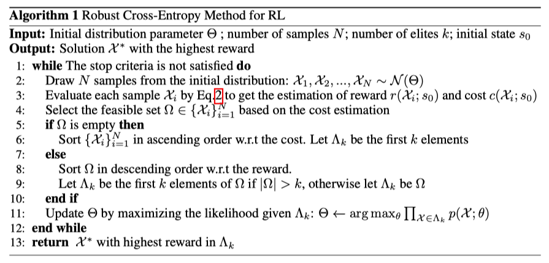
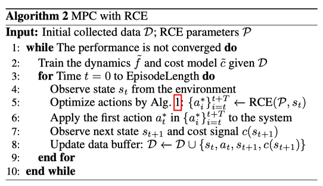

## The Purpose of This Study

환경의 dynamics를 모르고, 제약 조건 위반이 조금만 허락된 상황에서 에이전트가 효과적으로 환경을 탐색할 수 있도록하는 모델 기반 방법을 제안

observation space과 constraint violation의 관계를 수학적으로 명확히 표현하기는 어렵기 때문에 dynamics와 constraints에 대한 추가적인 정보 없이 학습해야 함.

이러한 문제는 아래 세 가지 이유로 풀기가 어려움
- Model-free 방법은 끊임없이 제약 조건을 위반하면서 위험한 데이터를 수집하고 정책을 학습해야 하는데 일부 어플리케이션에서는 이러한 방식이 제한될 수 있음
- Task objective와 safety objective가 상충할 수 있음
- Constraint function과 환경의 dynamics를 모르기 떄문에 최적화를 어렵게 만듦

Robust cross-entropy method를 통해 모델 불확실성과 제약 조건을 고려하면서 최적화하는 방법을 제안

## Methods

dynamics와 cost function을 수집한 데이터를 가지고 모델 학습.

- dynamics -> ensemble of neural networks
- cost -> binary classification model (LightGBM)

이를 가지고 아래 최적화 문제를 풂.

**MPC with Learned Model-based**
- $\mathcal{X} = (a_0, \ldots, a_T)$: sequence of actions
- $T$: planning horizon

$$
\begin{aligned}
&\mathcal{X} = \arg\max_{a_0, \ldots, a_T} \mathbb{E}\left[ \sum^T_{t = 0} \gamma^t r(s_{t + 1}) \right] \\
&\text{s. t.} \; s_{t + 1} = f(s_t, a_t), c(s_{t + 1}) = 0, \quad \forall t \in \{0, 1, \ldots, T - 1\}
\end{aligned}
$$

^0e789e

식 [[#^0e789e]] 에서 $\arg\max$ 왼쪽에 있는 $\mathcal{X}$는 optimal action sequence를 의미

**Robust Cross-Entropy Method**

위 최적화 문제를 풀기 위해 [[Paper-Reviews/RL/Deep Reinforcement Learning in a Handful of Trials using Probabilistic Dynamics Models/Review|Review]]에서 사용한 trajectory sampling (TS)을 사용. (샘플링된 미래 trajectories 중 가장 제약 조건 위반을 위반한 최악의 경우를 고려)

따라서 다음과 같이 accumulated reward, cost를 평가할 수 있음.

$$
r(\mathcal{X};s_0) = \sum^T_{t = 0} \gamma^t \left(\frac{1}{B} \sum^B_{b = 1} r(s^b_{t + 1}) \right), \quad c(\mathcal{X};s_0) = \sum^T_{t = 0} \beta^t \max_b c(s^b_{t + 1})
$$

^3b3078

where $s^b_{t + 1} = \tilde{f}_{\theta_b}(s^b_t, a_t), \forall t \in \{0, \ldots, T - 1\}, \forall b \in \{1, \ldots, B\}$, $\gamma$ and $\beta$ are discounting factors, and $B$ is the ensemble size of the dynamics model.

이때 $\bar{f}_{\theta_b}$는 학습된 dynamics model을 의미

Robust Cross-Entropy Method는 분포로부터 actio을 샘플링하는 방식 (이 분포는 $\Theta$로 parameterized)

1. Initial distribution으로부터 N개의 샘플을 샘플링
2. 학습된 모델로 reward, cost를 추정(*reward는 어떻게 추정한건지..?*)
3. feasible set으로부터 제약 조건을 만족하는 해(식 [[#^3b3078]] 의 집합을 선택하고, 정렬하여 상위 $k$개의 샘플로 distribution parameter를 업데이트

알고리즘 1은 Robust Cross-Entropy Method(RCE의 distribution을 업데이트하면서, 최적의 action sequence를 리턴함), 알고리즘 2는 MPC를 사용해서 planning 하는 알고리즘

## Results & Discussion

## Critique

논문의 알고리즘을 정리하면

1. 환경의 dynamics를 학습(transition, cost) - Alg 2. line 2
2. 매 스텝마다 RCE로 최적의 action sequence를 계산 (이때 Trajectory Sampling이 사용됨) - Alg 2. line 5 (Alg 1)
3. 첫 번째 행동만 실행 - Alg 2. line 6

이 전체 프로세스가 MPC

논문에서는 pseudo lidar 대신 상대 좌표를 observation으로 사용