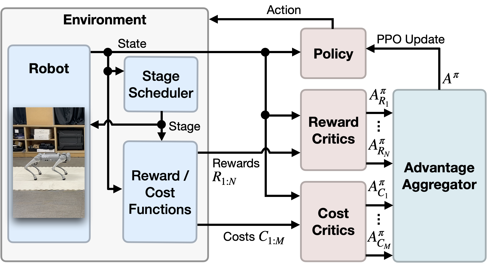

## The Purpose of This Study
reward function은 일반적으로 성능, 안전, 규제와 관련된 여러 terms의 합으로 구성된다.

이러한 많은 terms들은 reward shaping process를 어렵게 만든다. (laborious, challenging)

imitation RL의 경우 보상 설계는 쉽지만(수집된 데이터와 로봇의 pose 사이의 차이를 최소화하도록 정의) 데이터를 수집하는데 많은 비용이 든다.

따라서 논문에서는 constrained multi-objective RL (CMORL) 프레임워크를 통해 multiple reward functions를 stage-wise 방식으로 정의하는 강화학습 방법을 제안한다.

## Methods

논문에서는 위 두 figure와 같이 하나의 task를 여러 단계의 행동으로 나누어 구분하고, 각 단계별로 reward와 cost를 정의하였다.

**CMORL Problem Setup**

$$
\begin{aligned}
&\max_{\pi} J_{R_i}(\pi) \quad \forall i \in \{1, \ldots, N\} \\
&\text{s.t.} J_{C_j}(\pi) \leq \frac{d_j}{(1 - \gamma)} \quad \forall j \in \{1, \ldots, M\}
\end{aligned}
$$

**CMORL Policy Update**

$$
\pi_{t + 1} = \arg \max_{\pi} \mathbb{E}_{\tau \sim \pi_t} [\min (r_t A^{\pi_t}, \text{clip}(r_t, 1 - \epsilon, 1 + \epsilon) A^{\pi_t})]
$$
$$
A^{\pi} = \frac{A^{\pi}_R}{\text{std} [A^{\pi}_R]} - \eta \sum_j \frac{A^{\pi}_{C_j}}{\text{std}[A^{\pi}_{C_j}]} \mathbf{1}_{(J_{C_i}(\pi) > d_i)}
$$
$$
A^{\pi}_R := \sum_i \omega_i \hat{A}^{\pi}_{R_i}, \quad \omega \in \Omega = \{v \in \mathbb{R}^N | \sum_i v_i = 1, v_i \geq 0\}
$$
preference vector $\omega$를 통해 stage-wise reward advantage를 scalarization 한다.

또한 sim-to-real을 위해서 domain randomization과 teacher-student learning을 적용했다.

- domain randomization: motor strength, gravity, friction, restitution, noise in joint position positions and velocities, base orientation
- teacher-student learning
	1. teacher policy를 privileged information(시뮬레이션 환경에서만 알 수 있는 모든 정답 - 바닥의 정확한 마찰 계수, 중력 값 등)을 보고 학습한 다음, 시뮬레이션 환경에서 student policy를 실제로 행동하게 한다.
	2. student policy가 볼 수 있는 센서 데이터(observation), 그 상태에서 teacher policy가 한 행동을 기록한다. (논문에서는 고정된 주기로 teacher policy와 student policy가 번갈아 가면서 학습했다고 한다 - *This helps in collecting a dataset for teacher-student learning that closely aligns with the student policy*)
	3. 이를 토대로 imitation learning을 적용한다.

cf) 

teacher policy의 행동만 가지고 학습할 경우, 항상 좋은 상태만 방문하게 된다.

하지만 student policy는 불완전하기 때문에 나쁜 상태에서 어떻게 행동해야 하는지 배우지 못하게 된다.

결국 이 나쁜 상태에서 완전히 잘못된 행동을 할 경우 큰 실패로 이어질 수 있는데, 이는 distribution mismatch 문제이다.

이를 해결하기 위해 번갈아가면서 행동을 한다는 것 같다.

## Results & Discussion

논문에서는 제안 방법을 PPO와 [P3O](https://arxiv.org/abs/2205.11814)와 비교했다.

현재는 stage를 수동으로 나눠야 했지만, 추후 연구에서는 복잡한 태스크에서도 자동적으로 stage를 나누는 효율적인 기술을 연구할 예정이라고 한다.

## Critique

robot task에서는 reward와 cost가 로봇의 상태(속도, 토크 등)에 따라 정의되기 때문에 내가 주로 하는 차량과는 다르게? 다른 pose에서도 동일한 reward가 발생할 수도 있을 것 같다.

예를 들어 차량에서는 속도가 80km 이상이면 보상을 주고, 미만이면 주지 않도록 정의했더라면 로봇에서는 다른 pose인데도 상태에 따라 동일한 reward가 들어갈 수도 있으므로?

그래서 제안한 방법이 의미가 있는 것 같다. (학습의 난이도를 낮추고 보상 간의 충돌을 막음)

chatGPT의 설명은 다음과 같다.

1. sparse reward: backflip 성공시 +100, 그 외에는 0으로 설정

수백만 번을 무작위로 움직여서 이 완벽한 시퀀스를 우연히 발견하기는 굉장히 어려움 -> 전혀 감을 잡지 못하고 학습이 실패할 수 있음

2. conditional reward: 앉으면 +1, 공중에 뜨면 +10, 회전하면 +50 ··

이 경우에는 로봇이 보상의 총합을 최대로 받기 위해 어설프게 웅크린 채 살짝 점프하는 등의 이상한 행동을 배울 수도 있음.

즉, 각 단계의 명확한 동작을 배우는 것이 아니라, 모든 보상을 조금씩 얻으련느 타협안을 배울 수도 있음.

3. stage reward

보상 함수가 활성화되는 시점을 단계별로 나누었기 때문에 해야 할 일의 명확한 순서(curriculum)를 알려준다. (보상 충돌이 없음)