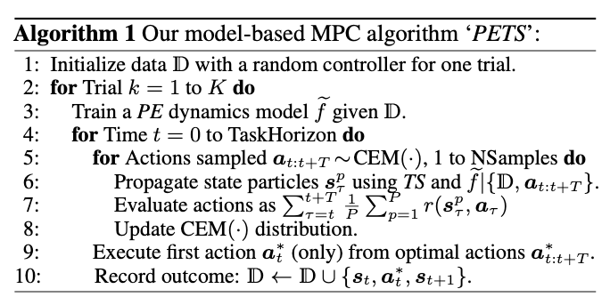

## The Purpose of This Study

Model-based RL 알고리즘들은 sample efficiency가 좋음

하지만, 수렴 성능은 Model-free 알고리즘들보다 낮음

저자들은 두 가지 특성을 관찰함

1. Model-based RL에서는 model capacity가 중요
	- Gaussian processes는 작은 데이터셋에서도 효율적으로 빠르게 학습하지만, 복잡하거나 불연속적인 시스템에서는 잘 동작하지 않음
	- Neural network는 큰 데이터셋, 고차원 입력에서도 효과적으로 잘 동작하지만 과적합 문제가 발생할 수 있음
2. dynamics model에 uncertainty를 적절히 통합함으로써 이러한 문제를 완화할 수 있음

논문에서는 uncertainty-aware dynamics models을 통해 이러한 차이를 줄이고자 함

Probabilistic ensembles with trajectory sampling (PETS)를 제안

## Lit. Review

MBRL에서 모델을 선택하는 것은 어려움

데이터가 적은 구간(low-data regimes)부터 많은 구간(high-data regimes)까지 모두 학습이 잘되어야 하는데 데이터가 적을 때는 Bayesian nonparameteric models(e.g., Gaussian processes)이 잘되고, 데이터가 많을 때는 parametric function approximators(e.g., Neural networks)가 잘 됨.

MBRL 알고리즘에서는 작은 bias가 제어기에 상당한 영향을 미치기 때문에 모델을 선택하는 것이 중요함

따라서, low & high data regimes에서 모두 잘되는 모델을 만드는 것이 주요 챌린지.

불확실성에는 두 가지 종류가 존재
- Aleatoric uncertainty: 시스템의 내재적인 확률적 특성으로 인해 발생하는 불확실성(e.g., observation noise, process noise)
  parameterized distribution의 출력으로 이러한 불확실성을 확인할 수 있음.
- Epistemic uncertainty: 시스템을 정확하게 학습하기 위한 데이터의 부족으로 인해 발생하는 불확실성

이 논문에서는
- probabilistic networks -> aleatoric uncertainty
- ensembles -> epistemic uncertainty
를 다룬다.

Probabilistic neural networks는 확률 분포 함수를 간단하게 parameterize한 네트워크(*네트워크 출력이 평균, 분산인 네트워크를 의미하는듯?*)

Epistemic uncertainty를 확인하기 위해 Bayesian inference가 주로 사용되는데,bootstrapped models을 앙상블 하는 방법이 더 간단하면서도, 튜닝할 필요도 없음. (논문에서는 5개의 bootstrapped model로 충분했다고 함)

## Methods

MBRL 정책을 사용해서 planning 할 수도 있지만, 논문에서는 MPC를 사용

[Neural network dynamics for Model-Based Deep Reinforcement Learning with Model-Free Fine-Tuning](https://arxiv.org/abs/1708.02596) 이 논문은 같은 연도 ICRA 2018에 출판된 논문인데 (같은 Sergey-Levine 연구실), 이 논문에서는 `deterministic NN + MPC + random shooting`을 사용

이 논문에서는 `probabilistic NN + MPC + CEM(Cross-Entropy Method)`을 사용

[The Cross-Entropy Method for Optimization](https://people.smp.uq.edu.au/DirkKroese/ps/CEopt.pdf): 이전에 높은 보상을 얻은 action 샘플과 비슷한 분포로부터 행동을 샘플링하는 방법

다음 상태를 model로 예측하면, 이에 따른 보상도 계산해야 하는데 closed-form으로 계산하는 것은 불가능
<mark style="background: #FFB8EBA6;">논문에서 reward를 어떻게 계산하는지가 명확히 안 나와있음</mark>

여러 접근 방법(deterministic, particle, parametric methods)이 있지만 논문에서는 particle-based methods를 사용

*Parametric methods가 많이 활용되어 왔지만, 실험 결과에 따르면 particle methods가 분포에 대한 강한 가정 없이도 계산 효율성과 정확도 측면에서 경쟁력이 있음을 보였다고 한다.*

현재 상태로부터 $P$개의 particles를 생성하고, $B$개의 bootstrap 모델로 각 particle들을 전파(propagate)

이때 두 가지 방법이 가능
- TS1: 매 스텝마다 모델을 uniformly re-sampling해서 사용
- $\text{TS}_\infty$: bootstrap 모델을 바꾸지 않고 끝까지 사용.
	- Aleatoric uncertainty와 Epistemic uncertainties를 구분할 수 있다는 장점

논문에서는 $P = 20, B = 5$를 사용

## Results & Discussion

논문에서는 제안한 방법이 Bayesian nonparametric models(GPs) 뿐만 아니라 model-free algorithms(PPO, SAC)과 비교했을 때에도 경쟁력 있는 성능을 달성할 수 있음을 보임

논문에서 사용한 방법들은 새로운 것들이 아니라 모두 기존에 있던 방법들(ensemble, outputting Gaussian distribution parameters, MPC for model-based RL)

이러한 것들을 잘 활용(uncertainty estimation을 모델 학습 과정에 통합)함으로써 수렴 성능을 개선할 수 있었다.

**Future work**

테스트 시점에서의 planning 비용을 줄이기 위해 제안한 프레임워크에 정책 학습을 통합하는 방법을 조사

불확실성을 고려한 모델(제안 방법)을 통해 gradient를 직접 전파하는 방식으로 정책 학습을 진행하는 실험을 진행했었는데, chaotic policy gradient 때문에 효과적인 알고리즘을 얻지는 못했다고 함.

## Critique

기존에 있던 방법들을 잘 조합해서 활용한 논문

아직 내가 model-based RL에 대한 이해가 깊지 않아서 그런지, 완벽하게 이해하진 못했다.

가장 이해가 안된 부분은 보상 함수를 어떻게 계산하는지인데,

일단 지금까지 내가 이해한 바는

probabilistic neural networks를 B개 ensemble

현재 상태 $s_t$가 있을 때 particle을 P개 생성해서, Trajectory Sampling (TS)을 통해 각 particle들을 가상으로 rollout

이때 action은 Cross-Entropy Method (CEM)로 이전에 높은 보상을 얻었던 action 샘플과 비슷한 분포로부터 행동을 샘플링

- Q1: MPC는 어디 들어가는건지??

MPC는 CEM으로 action sequence를 결정하고, dynamics model로 rollout 해서 계산된 expected reward로 평가하고, 이에 따라 최적의 행동을 선택하는 일련의 과정이 MPC

매 스텝마다 MPC로 action sequence를 최적화해야 함 (계산량이 많음)

- Q2: reward는 어떻게 계산하는건지??

보상 함수를 알고 있다고 가정해서, state-action pair로 계산을 하는건지? 아니면 실제 환경에서 rollout하는건지 잘 모르겠다.

아마도 보상 함수를 알고 있다고 가정해서 계산하는 것 같은데, 이 부분이 명확하지가 않다.

- Q3: Dreamer와 Model-based RL의 차이?

논문에서 제안한 PETS는 매 스텝마다 planning을 위해서 MPC로 action sequence를 최적화 했음

**Dreamer**

World model을 학습하고 그 모델을 이용해 상상(imagination) 속에서 policy를 학습하는 Model-based RL

observation을 latent state로 압축하고, latent dynamics를 학습(다음 상태 $s_{t + 1}$, 보상 $r$을 예측하는 모델)

이를 통해 imagination rollout으로 policy를 학습함으로써 실제 환경 interaction을 줄임.
