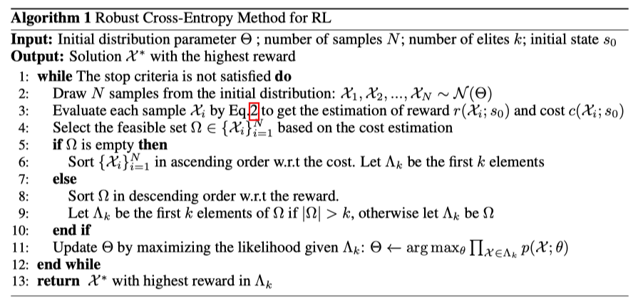
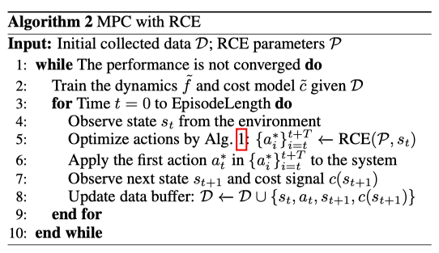
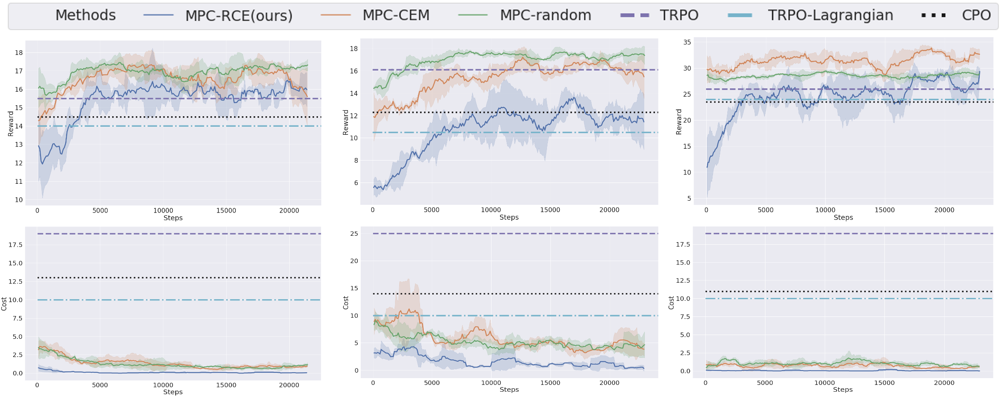

## The Purpose of This Study

### Abstract

We propose a model-based approach to enable RL agents to effectively explore the environment with unknown system dynamics and environment constraints given a significantly small number of violation budgets. (sparse indicator signals for constraint violations)

We employ the neural network ensemble model to estimate the prediction uncertainty and use model predictive control as the basic control framework.

We propose the robust cross-entropy method to optimize the control sequence considering the model uncertainty and constraints.

### 1. Introduction

The observations of the robot are sensor data, so it is hard to analytically express the mapping from observation space to the constraint violation.
Thus we are interested in the hardest cases where both dynamics and constraints are needed to be learned from data without additional info.

The challenges of solving the above problem are threefold:
1. Pure model-free, safe RL algorithms need to constantly violate safety constraints and collect a large number of unsafe data to learn the policy, which restricts the application in safety-critical environments.
2. The task objective and safety objective of an RL agent may contradict each other, which may corrupt the policy optimization procedure for methods that simply transform the original reward to the combination of reward and constraint violation cost.
3. The black-box constraint function and unknown environment dynamics model make the problem hard to optimize.

As far as we are aware, very little research has been done to investigate situations in which the dynamics and the constraint are both unknown.

## Methods

### Model Learning

Since the dynamics $f(s_t, a_t)$ and the cost (constraint violation) model $c(s_{t + 1})$ are both unknown, we need to infer them from collected samples.

We use an ensemble of neural networks to learn the dynamics and estimate uncertainty (subjective uncertainty due to a lack of data) of the input data.

Any binary classification model could be used to approximate the cost model because it is an indicator function.

We adopt a LightGBM to learn the cost model.

### MPC with Learned Model-based

We use Model Predictive Control(MPC) as the basic control framework for our constrained model-based RL approach.

In our safe RL setting additional constraints are introduced so that the original objective becomes a constrained optimization problem.

$$
\begin{aligned}
&\mathcal{X} = \arg\max_{a_0, \ldots, a_T} \mathbb{E}\left[ \sum^T_{t = 0} \gamma^t r(s_{t + 1}) \right] \\
&\text{s. t.} \; s_{t + 1} = f(s_t, a_t), c(s_{t + 1}) = 0, \quad \forall t \in \{0, 1, \ldots, T - 1\}
\end{aligned}
\tag{1}
$$

### Robust Cross-Entropy Method

To directly solve the constrained optimization problem in  Eq. 1, we propose the robust cross-entropy method (RCE) by using the trajectory sampling (TS) technique ([[🇺🇸 Deep Reinforcement Learning in a Handful of Trials using Probabilistic Dynamics Models]]) to estimate reward and constraint violation cost.

Given the initial state $s_0$, we can evaluate the accumulated reward and cost of the solution by:
$$
r(\mathcal{X};s_0) = \sum^T_{t = 0} \gamma^t \left(\frac{1}{B} \sum^B_{b = 1} r(s^b_{t + 1}) \right), \quad c(\mathcal{X};s_0) = \sum^T_{t = 0} \beta^t \max_b c(s^b_{t + 1})
\tag{2}
$$
where $s^b_{t + 1} = \tilde{f}_{\theta_b}(s^b_t, a_t), \forall t \in \{0, \ldots, T - 1\}, \forall b \in \{1, \ldots, B\}$, $\gamma$ and $\beta$ are discounting factors, and $B$ is the ensemble size of the dynamics model.

The intuition of TS is to consider the worst-case scenario of constraint violations among all sampled future trajectories with dynamics prediction uncertainty.

1. Our RCE methods first selects the feasible set of solutions that satisfy the constraints based on the estimated cost in Eq. 2.
2. We sort the solutions in the feasible set and select the top $k$ samples to use when calculating the parameters of the sampling distribution for the next iteration.
3. If all samples violate at least one constraint, we select the top $k$ samples with the lowest costs.

The entire training pipeline of our MPC with RCE is presented in Algorithm 2.

## Results & Discussion

### 3. Experiment Validation

Fig. 2 shows the learning curves of reward and constraint violation cost.

From the figure, it is apparent that our MPC-RCE approach learns the underlying constraint function very quickly to avoid unsafe behaviors during the exploration and achieves the lowest constraint violation rate, through its reward is slightly lower than other methods. (It is reasonable because the best policy to maximize the task reward is to ignore the constraints.)

### Appendix

#### A.1 Discussion about the Safety Gym environment and the task setting

The observation space used in our approach is different from the default Safety Gym options in that we pre-process the sensor data to get rid of some noisy and unstable sensor, such as the $z$-axis data of accelerometer.

We use the relative coordinates of the perceived objective instead of the pseudo-lidar.

We also performed careful hand-tuning of some MuJoCo actuator parameters.

#### A.2 Training Detail

##### Dynamic model

We use the same architecture and hyper-parameters of each neural network in the ensemble dynamics model.

Each neural network is of 3 layers with ReLU activation and each layer is of 1024 neurons.

The batch size is 256, the learning rate is 0.001, the training epochs are 70, and the optimizer is Adam.

The ensemble number is 4 for Point robot tasks and is 5 for Car robot tasks.

Each neural network model in the ensemble is trained with 80% of the training data to prevent overfitting.