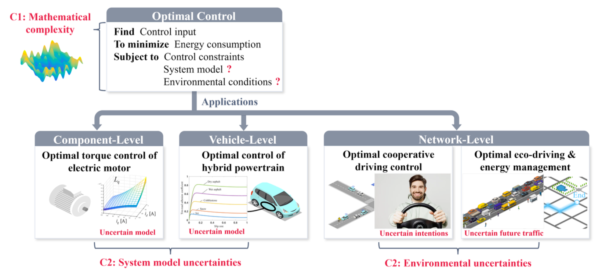
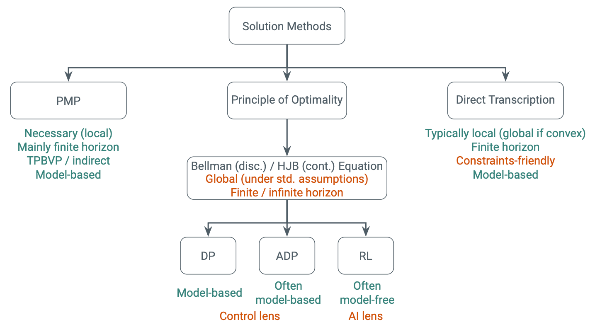
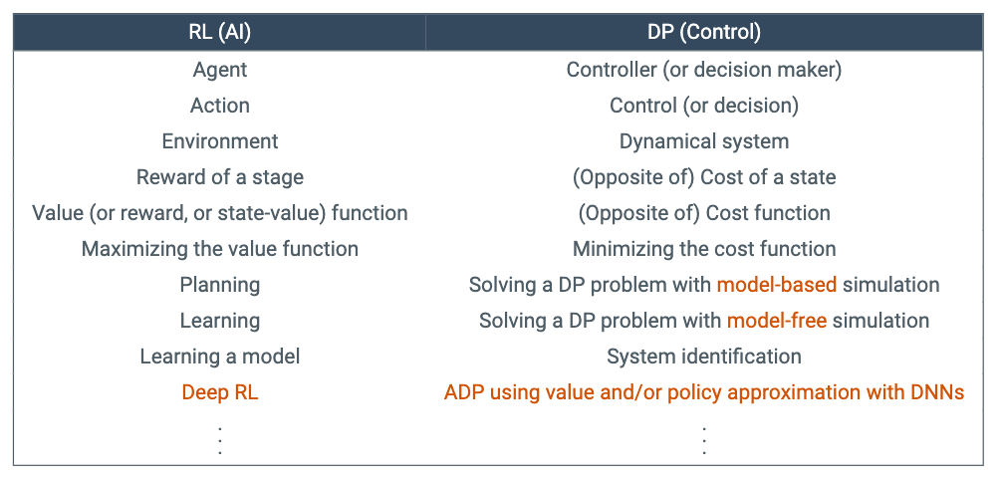

## Multiple Control Levels in CAEVs
차량에는 다양한 수준의 자유도(multiple degrees of freedom)가 존재
- Network level
- Vehicle level
- Component level

## Optimal Control of CAEVs

이를 고려하여 최적 제어를 할 수 있음

## Challenges in Optimal Control of CAEVs
하지만 몇 가지 한계점이 존재

1. Mathematical complexity: analytic solution을 구하지 못할 수도 있음
2. Uncertainties
	- System model: key parameters가 시스템 동작에 달려있거나, 제조 과정에 따라 달라질 수 있음
	- Environmental: 운전자의 의도를 알 수 없음

## Motivation for Learning-based Control
Mathematical complexity

- Numerical optimization: 문제를 반복적으로 풂 (MPC)
- computationally  heavy, not efficient ☹️ ⇒ `Policy learning`

Uncertainties

- Conventional approach
	- Robust control: 불확실성을 일괄적으로 다룸 (nominal system 모델을 사용) → 불확실성을 보수적으로 다루기 때문에 최적 성능을 달성하기 어려움 ☹️
	- Adaptive control/estimation: 시스템의 불확실한 파라미터를 추정하면서 제어기를 조정(transient phase: 시스템이 steady-state에 도달하기 전의 단계) → transient phase에서는 추정이 정확하지 않음 ☹️
	- ⇒ `Model learning`

## Optimal Control
최적 제어 문제를 풀기 위한 방법들을 분류 (*이렇게 나눈 이유?*)

- Pontrygain's Maximum Principle (PMP)
	- finite horizon
	- local solution
- Principle of Optimality
	- Bellman (discrete time), Hamilton Jacobian (continuous time)
	- standard assumption하에서 global solution
	- finite/infinite horizon 둘 다 가능
	- ex) DP, ADP(Approximate DP), RL
- Direct Transcription
	- 문제를 discretize
	- constraints를 다루기 유용
	- local solution
	- finite horizon

## DP / ADP / RL
DP는 차원의 저주(curse of dimensionalty), math(target) model이 필요하다는 한계점이 있음
⇒ Approximation DP(neural networks 또는 차원을 줄이기 위한 architecture), RL (math model 대신 시뮬레이션(computer model)을 사용)

ADP는 control society, RL은 AI community에서 시작됐지만, 본질(essential)은 같다고 함

- [ ] [Reinforcement Learning and Optimal Control](file:///Users/seominseok/Study/RL/Reinforcement%20Learning%20and%20Optimal%20Control.pdf) Chap 1 읽기