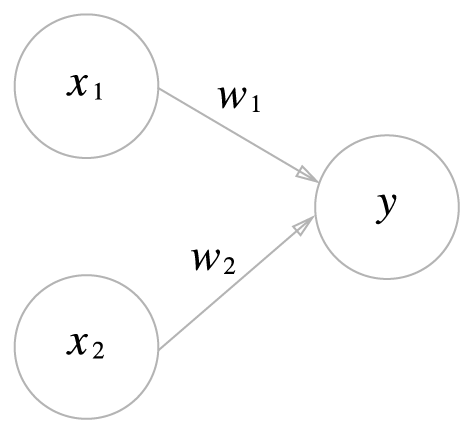
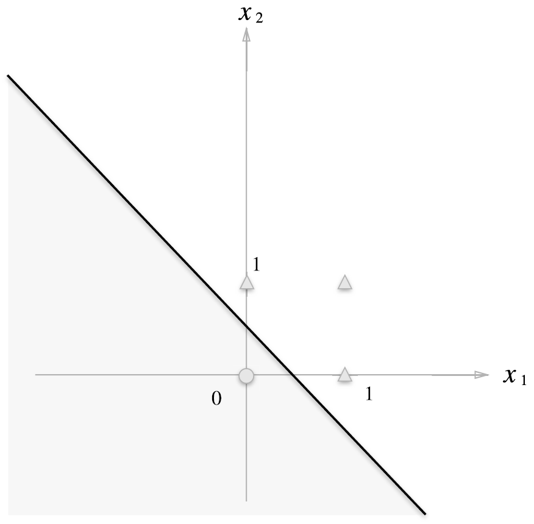
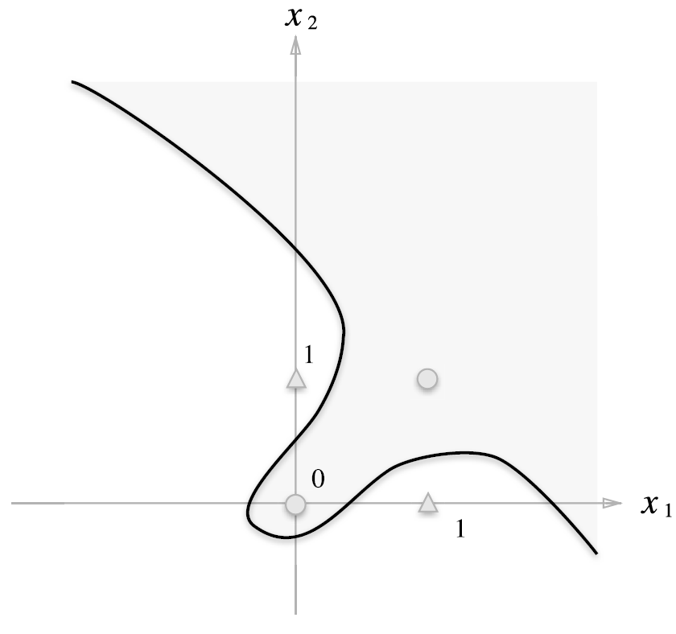
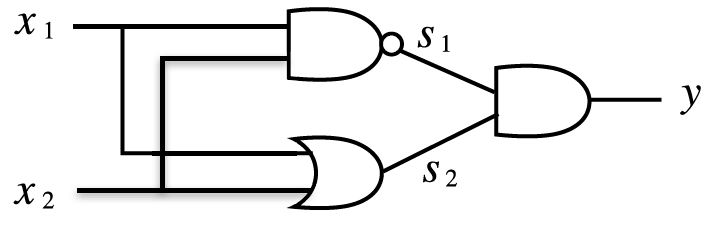
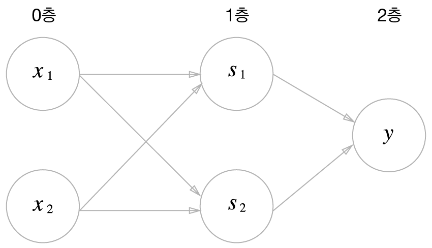

Perceptron은 Frank Fosenblatt가 1957년에 고안한 알고리즘

이 장에서 언급하는 퍼셉트론은 실제로는 인공 뉴런, 단순 퍼셉트론이지만 책에서는 퍼셉트론이라고 지칭

퍼셉트론은 다수의 신호를 입력으로 받아 하나의 신호를 출력




위 그림은 2개의 신호를 받는 퍼셉트론의 예시

$x_1, x_2$는 입력 신호, $y$는 출력 신호, $w_1, w_2$는 가중치

입력 신호가 다음 뉴런(원)에 보내질 때 각각의 고유한 가중치가 곱해지고, 이 신호의 총합이 임계값($\theta$)를 넘을 때만 1을 출력

$$
y = 
\begin{cases}
0 \; (w_1 x_1 + w_2 x_2 \leq \theta) \\
1 \; (w_1 x_1 + w_2 x_2 > \theta)
\end{cases}
$$

^a30c2d

가중치는 각 신호가 결과에 주는 영향력을 조절


위 퍼셉트론을 가지고, 아래 AND 게이트를 만들 수 있음

OR 게이트

| $x_1$ | $x_2$ | $y$ |
|:-----:|:-----:|:---:|
|   0   |   0   |  0  |
|   1   |   0   |  1  |
|   0   |   1   |  1  |
|   1   |   1   |  1  |

```python title:"OR"
def OR(x1, x2):
	w1, w2, theta = 0.5, 0.5, 0.2
	tmp = x1 * w1 + x2 * w2
	if tmp <= theta:
		return 0
	else:
		return 1
```

이때 퍼셉트론의 매개변수($w_1, w_2, \theta$)는 사람이 학습 데이터(여기서는 진리표)를 보면서 정함

적절한 매개변수 값을 정하는 것을 학습이라하며, 데이터가 주어졌을 때 컴퓨터가 자동으로 이 매개변수 값을 정하는 작업을 기계학습이라고 함

[[#^a30c2d]]에서 $\theta$를 $-b$로 치환하면 아래와 같이 수식을 바꿀 수 있음

$$
y = 
\begin{cases}
0 \; (b + w_1 x_1 + w_2 x_2 \geq 0) \\
1 \; (b + w_1 x_1 + w_2 x_2 > 0)
\end{cases}
$$

여기서 $b$를 bias 함

가중치는 각 입력 신호가 결과에 주는 영향력(중요도)을 조절하며, 편향은 뉴런이 얼마나 쉽게 활성화 되는지를 조절하는 파라미터임

ex)
- $b = -0.1$이면 각 입력 신호에 가중치를 곱한 값들의 합이 0.1을 초과하면 뉴런이 활성화 됨
- $b = -20$이면 각 입력 신호에 가중치를 곱한 값들의 합이 20을 초과하면 뉴런이 활성화 됨

```python title:"OR with bias"
def OR(x1, x2):
	x = np.array([x1, x2])
	w = np.array([0.5, 0.5])
	b = -0.2
	tmp = np.sum(w * x) + b
	if tmp <= 0:
		return 0
	else:
		return 1
```

이를 그림으로 나타내면 다음과 같다.



하지만 단층 퍼셉트론만 사용해서는 아래와 같은 비선형 함수(XOR 게이트)를 만들 수 없다.



XOR 게이트는 다음과 같이  NAND 게이트와 OR 게이트, 그리고 AND 게이트를 조합해서 만들 수 있다.



즉, 퍼셉트론을 여러 층으로 만들면 비선형 함수도 표현할 수 있게 된다.

