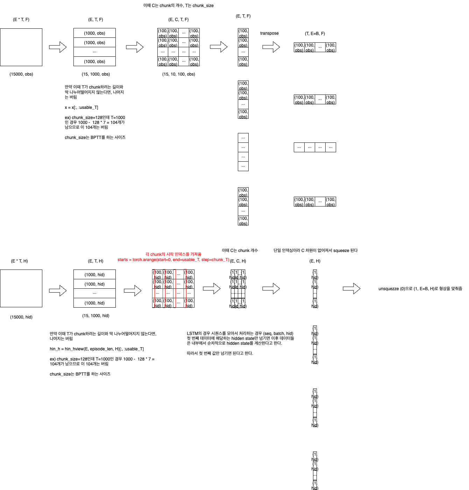

```python
output, (h_n, c_n) = lstm(input, (h_0, c_0))
```

PyTorch의 LSTM 모듈은 (seq, batch, hid) shape으로 입력 데이터를 처리 

- `batch_first=False (default)`: (seq, batch, hid)
- `batch_first=True`: (batch, seq, hid)

여기서 seq는 Truncated Back Propagation Through Time(BPTT)에서 사용하는 시간 축의 길이를 의미


입력 데이터의 형상에 따라 처리가 달라지는데 PyTorch 내부적으로 어떻게 돌아가는지 이해가 안됐음

rollout 할 때는 명시적으로 hidden state를 넘겨주지만
```python
h_out = (torch.zeros([1, 1, 32], dtype=torch.float), torch.zeros([1, 1, 32], dtype=torch.float))
s, _ = env.reset()
done = False

while not done:
	for t in range(T_horizon):
		h_in = h_out
		prob, h_out = model.pi(torch.from_numpy(s).float(), h_in)
```

배치 처리할 때는 배치의 맨 첫 번째 데이터에 해당하는 hidden state만 넘겨줌
```python
def make_batch(self):
	return s,a,r,s_prime, done_mask, prob_a, h_in_lst[0], h_out_lst[0]
	
def train_net(self):
	s,a,r,s_prime,done_mask, prob_a, (h1_in, h2_in), (h1_out, h2_out) = self.make_batch()
	first_hidden  = (h1_in.detach(), h2_in.detach())
	second_hidden = (h1_out.detach(), h2_out.detach())

	for i in range(K_epoch):
		v_prime = self.v(s_prime, second_hidden).squeeze(1)
		td_target = r + gamma * v_prime * done_mask
		v_s = self.v(s, first_hidden).squeeze(1)
```

ChatGPT에 따르면, T_horizon짜리 시퀀스를 모아놓은 경우 (seq, batch, hid) 첫 번째 데이터에 해당하는 hidden_state만 주면, 이후 데이터들은 내부에서 순차적으로 hidden_state를 계산한다고 한다.


지금 내 코드에서는 (steps_per_epoch, feature) shape으로 모든 데이터가 저장돼 있다.

1. 이를 (episodes, steps, feature)로 reshape
2. [(episode, chunk_steps, feature), (episode, chunk_steps, feature), ···] 형태로 변환 (episode_len를 chunk_steps로 쪼갠다.)
	- 이때 chunk_steps로 딱 나누어 떨어지지 않을 경우 나머지는 버린다.
	- episode_len=1000, chunk_steps=128인 경우: 1000 - 128 * 7 = 104개의 데이터는 버림
3. 마지막으로 transpose 해서 [(chunk_steps, episode, feature), (chunk_steps, episode, feature), ···]로 변경해서 사용


LSTM의 hidden state는 h, c는 위에서 언급한 것처럼 각 시퀀스의 첫번째 데이터에 해당하는 hidden state만 계산하면 되기 때문에 0번 인덱스의 데이터만 가져와서 사용한다.




```python
def split_to_TB_chunks_torch_with_h0(tensor_dict, episode_steps: int, chunk_T: int, drop_last_incomplete: bool = True, device=None):
    # 1. Calcualte number of episodes(E) and number of chunks (num_chunks), usable_T
    Ns = [v.shape[0] for v in tensor_dict.values()]
    N = Ns[0]  # N: total steps (batch size: episodes * episode_steps)
    assert all(n == N for n in Ns), "All tensors must share N as first dim."
    assert N % episode_steps == 0, f"N({N}) must be divisible by episode_steps({episode_steps})."
    E = N // episode_steps  # E: number of episodes

    if episode_steps % chunk_T != 0:
        if drop_last_incomplete:
            """
            Example: episode_steps=1000, chunk_T=128
            1000/128=7.8125 → 7 chunks of 128 steps
            usable_T=7*128=896
            Remaining 104 steps are discarded.
            """
            num_chunks = episode_steps // chunk_T
            usable_T = num_chunks * chunk_T
        else:
            raise ValueError("episode_steps not divisible by chunk_T.")
    else:
        """
        Example: episode_steps=1000, chunk_T=100
        1000/100=10 → 10 chunks of 100 steps
        usable_T=1000
        No steps are discarded.
        """
        num_chunks = episode_steps // chunk_T
        usable_T = episode_steps

    # 2. Except LSTM hidden state, reshape all tensors to (E, num_chunks, chunk_T, feat)
    arranged = {}
    keys_feat = []

    for k, v in tensor_dict.items():
        if k in ('hin_h', 'hin_c'):  # Except LSTM hidden states
            continue
        x = v if device is None else v.to(device)
        if x.ndim == 1:
            x = x.unsqueeze(-1)  # (N,) -> (N,1) for consistency
        F = x.shape[-1]  # feature dimension
        x = x[:E * episode_steps]  # x: (E * episode_steps, F)
        x = x.view(E, episode_steps, F)  # x: (E, episode_steps, F)
        x = x[:, :usable_T]  # truncate to usable_T
        x = x.view(E, num_chunks, chunk_T, F)  # x: (E, num_chunks, chunk_T, F)
        arranged[k] = x
        keys_feat.append(k)

    # 3. Prepare initial hidden states h0 for each chunk
    H = tensor_dict['hin_h'].shape[-1]  # tensor_dict['hin_h']: (N, H)
    hin_h = (tensor_dict['hin_h'] if device is None else tensor_dict['hin_h'].to(device))[:E*episode_steps]  # hin_h: (E * episode_steps, H)
    hin_c = (tensor_dict['hin_c'] if device is None else tensor_dict['hin_c'].to(device))[:E*episode_steps]
    hin_h = hin_h.view(E, episode_steps, H)[:, :usable_T]   # hin_h: (E, episode_steps, H) -> (E, usable_T, H)
    hin_c = hin_c.view(E, episode_steps, H)[:, :usable_T]
    # Each chunk's initial hidden state is the hidden state at the chunk's start time
    starts = torch.arange(start=0, end=usable_T, step=chunk_T, device=hin_h.device)  # starts: (C, )
    h0_h_all = hin_h.index_select(dim=1, index=starts)  # h0_h_all: (E, num_chunks, H)
    h0_c_all = hin_c.index_select(dim=1, index=starts)

    # 4. Return each chunk as (T, B, F) + h0
    out = []
    for c in range(num_chunks):
        batch_c = {}

        for k in keys_feat:
            x = arranged[k][:, c]                 # x: (E, T, F)
            x = x.permute(1, 0, 2).contiguous()   # x: (T, E=B, F)
            batch_c[k] = x

        # h0: (num_layers=1, B, H)
        h0_h = h0_h_all[:, c, :]  # (E, H)
        h0_c = h0_c_all[:, c, :]  # (E, H)
        batch_c['h0_h'] = h0_h.unsqueeze(0)  # (1, E=B, H)
        batch_c['h0_c'] = h0_c.unsqueeze(0)  # (1, E=B, H)

        out.append(batch_c)

    return out
```