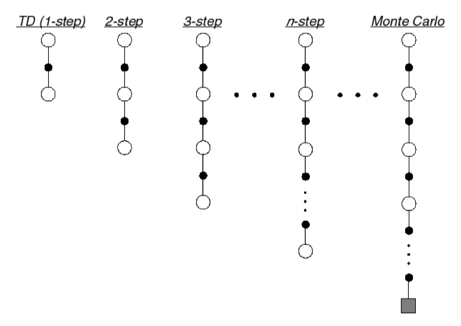
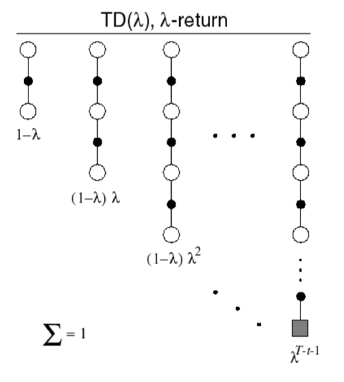
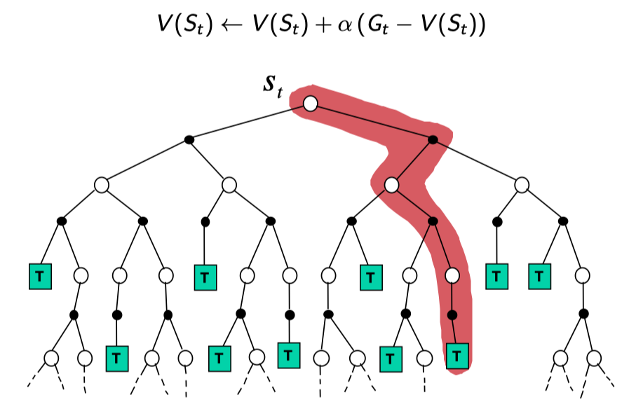
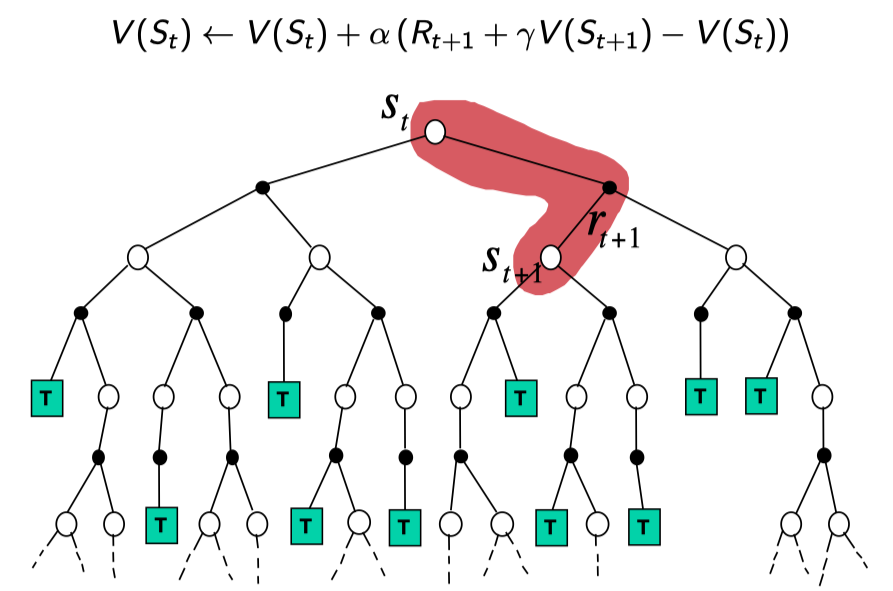
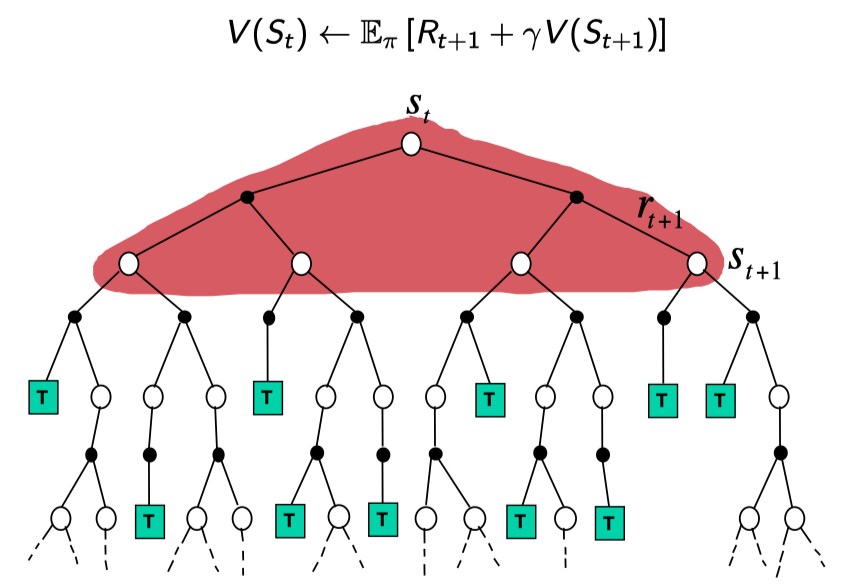

Prediction: value function을 찾는 것 (policy가 정해져 있어야 함)

> prediction은 Bellman Expectation equation을 사용
> Control은 Bellman Optimality equation을 사용

이번 챕터에서는 MDP를 모를 때 value function을 추정하는 방법을 배움

# Monte-Carlo Reinforcement Learning

Monte-Carlo는 직접 구하기 어려운 것들을 empirical하게 구하는 것을 의미
사건을 실행하면서 나오는 실제 값들을 통해 추정하는 방법

- MC methods learn directly from episodes of experience.
- MC learns from complete episodes
- MC uses the simplest possible idea: value = mean return
- Caveat: can only apply MC to episodic MDPs

## Monte-Carlo Policy Evaluation

Goal: learn $v_\pi$ from episodes of experience under policy $\pi$

$$ S_1, A_1, R_2 \ldots, S_k \sim \pi $$

Value function is the expected return:
$$ v_\pi(s) = \mathbb{E}_\pi [G_t | S_t = s] $$

Return is the total discounted return:
$$ G_t = R_{t + 1} + \gamma R_{t + 2} + \ldots + \gamma^{T - 1} R_T $$

**Monte-Carlo policy evaluation uses empirical mean return instead of expected return.**

- First-visit Monte-Carlo policy evaluation: The first time-step $t$ that state $s$ is visited in an episode, increment counter $N(s) \leftarrow N(s) + 1$
- Every-visit Monte-Carlo policy evaluation: Every time-step $t$ that state $s$ is visited in an episode, increment counter $N(s) \leftarrow N(s) + 1$
- Increment total return $S(s) \leftarrow S(s) + G_t$
- Value is estimated by mean return $V(s) = S(s) / N(s)$
- Again, $V(s) \rightarrow v_\pi(s)$ as $N(s) \rightarrow \infty$

### Incremental Mean

The mean $\mu_1, \mu_2, \ldots$ of a sequence $x_1, x_2, \ldots$ can be computed incrementally
$$
\begin{aligned}
\mu_k 
&= \frac{1}{k} \sum^k_{j = 1} x_j \\
&= \frac{1}{k} \left(x_k + \sum^{k - 1}_{j = 1} x_j \right) \\
&= \frac{1}{k} (x_k + (k - 1)\mu_{k - 1}) \quad \text{c.f)} \mu_{k - 1} = \frac{1}{k - 1} \sum^{k - 1}_{j = 1} x_j \\
&= \mu_{k - 1} + \frac{1}{k}(x_k - \mu_{k - 1})
\end{aligned}
$$

## Incremental Monte-Carlo Updates

Update $V(s)$ incrementally after episode $S_1, A_1, R_2, \ldots, S_T$.
For each state $S_t$ with return $G_t$
$$
\begin{aligned}
N(S_t) &\leftarrow N(S_t) + 1 \\
V(S_t) &\leftarrow V(S_t) + \frac{1}{N(S_t)}(G_t - V(S_t))
\end{aligned}
$$
<u>In non-stationary problems</u>, it can be useful to track a running mean, i.e. forget old episodes. (by replace $N(S_t)$ to $\alpha$)

$$ V(S_t) \leftarrow V(S_t) + \alpha(G_t - V(S_t)) $$

# Temporal-Difference Learning

- TD learns from incomplete episodes, by bootstrapping
- TD updates a guess toward a guess

## MC and TD

Goal: learn $v_\pi$ from episodes of experience under policy $\pi$

$$ S_1, A_1, R_2 \ldots, S_k \sim \pi $$

- MC: Update value $V(S_t)$ toward actual return $G_t$.
$$ V(S_t) \leftarrow V(S_t) + \alpha (G_t - V(S_t)) $$
- TD(0): Update value $V(S_t)$ toward estimated return $R_{t + 1} + \gamma V(S_{t + 1})$
$$ V(S_t) \leftarrow V(S_t) + \alpha (R_{t + 1} + \gamma V(S_{t + 1}) - V(S_t)) $$
	- $R_{t + 1} + \gamma V(S_{t + 1})$ is called TD target
	- $\delta_t = R_{t + 1} + \gamma V(S_{t + 1} - V(S_t)$ is called the TD error

TD의 경우 추정치로 업데이트하지만, 한 스텝만큼($R_{t + 1}$)의 실제 값이 반영돼 있기 때문에 실제 value function으로 수렴할 수 있음

## n-Step TD

### n-Step Prediction

- TD target can look n steps into the future

### n-step Return

Consider the following n-step returns for $n = 1, 2, \infty$:

$$
\begin{aligned}
&n = 1 \quad \text{TD} &G^{(1)}_t = &R_{t + 1} + \gamma V(S_{t + 1}) \\
&n = 2 \quad &G^{(1)}_t = &R_{t + 1} + \gamma R_{t + 2} \gamma^2 V(S_{t + 2}) \\
&n = \infty \quad &G^{(\infty)}_t = &R_{t + 1} + \gamma R_{t + 2} + \ldots + \gamma^{T - 1} R_T
\end{aligned}
$$

- Define the $n$-step return
$$
G^{(n)}_t = R_{t + 1} + \gamma R_{t + 2} + \ldots + \gamma^{n - 1} R_{t + n} + \gamma^n V(S_{t + n})
$$
- n-step temporal-difference learning
$$ V(S_t) \leftarrow V(S_t) + \alpha \left(G^{(n)}_t - V(S_t) \right) $$

## Forward View of TD($\lambda$)

The $\lambda$-return $G^\lambda_t$ combines all n-step returns $G^{(n)}_t$

Using weight $(1 - \lambda) \lambda^{n - 1}$

$$ G^\lambda_t = (1 - \lambda) \sum^\infty_{n = 1} \lambda^{n - 1} G^{(n)}_t $$
- Forward-view TD($\lambda$)
$$
V(S_t) \leftarrow V(S_t) + \alpha \left(G^\lambda_t - V(S_t)\right)
$$

## Backward View of TD($\lambda$)

앞서 forward view TD($\lambda$)의 경우 n-step이 끝날 때까지 기다려야 했음. (그래야만 n번째 step의 return을 알 수 있으니까)

Update online, every step, from incomplete sequences

### Eligibility Traces

Eligibility traces combine both heuristics
- Frequency heuristic: assign credit to most frequent states
- Recency heuristic: assign credit to most recent states

$$
\begin{aligned}
E_0(s) &= 0 \\
E_t(s) &= \gamma \lambda E_{t - 1}(s) + \mathbb{1}(S_t = s)
\end{aligned}
$$
상태별로 eligibility trace 값을 하나씩 갖고 있음 (방문하면 1, 안 방문할 때마다 $\gamma$만큼 줄임)
위 식에서 $\lambda$가 0이면 TD(0)가 되고, 1이면 MC가 된다.

- Keep an eligibility trace for every state $s$
- Update value $V(s)$ for every state $s$
- In proportion to TD-error $\delta_t$ and eligibility trace $E_t(s)$
$$
\begin{aligned}
\delta_t &= R_{t + 1} + \gamma V(S_{t + 1}) - V(S_t) \\
V(s) &\leftarrow V(s) + \alpha \delta_t E_t(s)
\end{aligned}
$$
TD(0)의 error를 그대로 사용했음에도 불구하고 TD($\lambda$)와 동일한 효과를 냄

## Advantages and Disadvantages of MC vs TD

- TD can learn before knowing the final outcome
- MC must wait until end of episode before return is known

- TD works in continuing (non-terminating) environments
- MC only works for episodic (terminating) environments

### Bias/Variance Trade-Off

확률 변수는 variance를 갖고 있음 (평균은로부터 얼마나 퍼져있는지)

- Return $G_t = R_{t + 1} + \gamma R_{t + 2} + \ldots + \gamma^{T - 1} R_T$ is <u>unbiased estimate of</u> $v_\pi(S_t)$
- <u>True  TD target</u> $R_{t + 1} + \gamma v_\pi(S_{t + 1})$ is <u>unbiased estimate of</u> $v_\pi(S_t)$
- However, <u>we don't know true TD target</u> so, TD target $R_{t + 1} + \gamma V(S_{t + 1})$ is <u>biased estimate of</u> $v_\pi(S_t)$
- TD target is much lower variance than the return.
	- Return depends on many random actions, transitions, rewards
	- TD target depends on one random action, transition, reward

## Advantages and Disadvantages of MC vs TD (2)

- MC has high variance, zero bias
	-  Good convergence properties (even with function approximation)
	- Not very sensitive to initial value
	- Very simple to understand and use
- TD has low variance, some bias
	- Usually more efficient than MC
	- TD(0) converges to $v_\pi(s)$ (but not always with function approximation)
	- More sensitive to initial value

# Unified View

- Monte-Carlo Backup

- Temporal-Difference Backup

- Dynamic Programming Backup

## Bootstrapping and Sampling

- Bootstrapping: update involves an estimate
	- DP, TD
- Sampling: update samples an expectation
	- MC, TD

샘플링이란 기댓값 계산에서 확률 분포의 모든 경우를 합산/적분하지 않고, 실제 관측된 데이터로 계산하는 것을 의미

