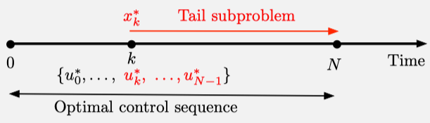

이 장에서는 exact dynamic programming (DP)에 대한 배경지식을 전달한다.

먼저 finite horizon problems에 대해 다룬다. (infinite horizon problems는 chap 4)

## 1.1 Deterministic Dynamic Programming

finite horizon problems는 시스템이 finite time steps(stages)$N$에 걸쳐 변화한다.

먼저, 다음 상태 $x_{k + 1}$가 랜덤하지 않게(nonrandomly) 오로지 state $x_k$와 control $u_k$에 의해 결정되는 deterministic system에 대해 다룬다.

### 1.1.1 Deterministic Problems

`finite horizon problems - deterministic problems`

deterministic DP problem에서 system equation은 다음과 같다.

$$
x_{k + 1} = f_k(x_k, u_k), \quad k = 0, 1, \ldots, N - 1
$$

^73aea5

- time index: $k$
- state of the system: $x_k$ (element of state space)
- control (decision variable): $u_k$ (selected at time $k$ from control space $U_k(x_k)$ that depends on $x_k$)
- $N$: horizon (number of times control is applied)

이 문제에는 가산적 특성(additive)을 갖는 cost function이 포함되어 있다.

즉 시간 $k$에서 발생하는 cost $g_k(x_k, u_k)$가 시간이 지남에 따라 누적(accumulate)된다.

이에 따라 initial state $x_0$와 control sequence $\{ u_0, \ldots, u_{N - 1} \}$가 주어졌을 때 total cost는 다음과 같이 정의된다.

$$
J(x_0;u_0, \ldots, u_{N - 1}) = g_N(x_N) + \sum^{N - 1}_{k = 0} g_k(x_k, u_k)
$$

$g_N(X_N)$은 마지막 시점에 발생하는 terminal cost이다.

> deterministic problem이기 때문에 initial state와 control sequence가 주어지면 유일하게 total cost가 정의된다.
> 
> This cost is a well-defined number.

**우리가 원하는 것은 control constraints를 만족하는 모든 sequences $\{ u_0, \ldots, u_{N - 1} \}$에서 cost를 최소화 하는 것이다.**

이에 따라 optimal cost value는 다음과 같이 정의된다.

$$
J^*(x_0) = \min_{\substack{u_k \in U_k(x_k) \\ k = 0, \ldots N - 1}} g_N(x_N) + \sum^{N - 1}_{k = 0} g_k(x_k, u_k)
$$

> 위 식에서 $\min_{\substack{u_k \in U_k(x_k) \\ k = 0, \ldots N - 1}}$의 의미는 모든 시점 $k = 0, 1, \ldots, N - 1$에서 사용하는 control $u_k$들을 하나의 시퀀스로 잡고, 전체 시퀀스가 total cost를 최소화하도록 만든다는 의미 (개별적으로 각 시점에서의 비용을 최소화하는게 아니라)

책에서는 deterministic dyanmic programming에서 control space가 discrete/continuous한 경우에 대한 예제가 나온다.

### 1.1.2 The Dynamic Programming Algorithm

##### Principle of Optimality

$\{ u^*_0, \ldots, u^*_{N - 1} \}$가 optimal control sequence라고 하자.

initial state $x_0$가 주어지면 system equaiton [[#^73aea5]]을 통해 state sequence $\{ x^*_1, \ldots, x^*_N \}$을 결정된다.

state $x_k$에 도달했을 때, time $k$부터 $N$까지 cost-to-go를 최소화하는 다음과 같은 subproblem을 생각해보자.

$$
g_k(x^*_k, u_k) + \sum^{N - 1}_{m = k + 1} g_m(x_m, u_m) + g_N(x_N)
$$

^0b2d1e

over $\{ u_k, \ldots, u_{N - 1} \}$ with $u_m \in U_m(x_m), m = k, \ldots, N - 1$.

위 subproblem에 대해 $\{ u^*_k, \ldots, u^*_{N - 1} \}$는 truncated optimal control sequence이다.

위 principle of optimality는 optimal cost function이 거꾸로 거슬러 올라가며 부분적으로(piecewise) 구성될 수 있음을 시사한다.

즉, optimal cost function을 한 번에 구하는 것이 아니라, 역순으로 한 단계씩 거슬러 올라가며 단계적으로 만들어질 수 있다는 것을 의미한다.

sequentially, starting from $J^*_N$, and proceeding backwards to $J^*_{N - 1}, J^*_{N - 2}$, etc.

##### DP Algorithm for Deterministic Finite Horizon Problems

terminal cost $J^*_N(x_N) = g_N(x_N), \; \text{for all } x_N$에서 시작하여(모든 상태 $x_N$에 대해 동일한 terminal cost를 사용한다는 의미)

$k = 0, \ldots, N - 1$일 때 

$$
J^*_k(x_k) = \min_{u_k \in U_k(x_k)} \left[ g_k(x_k, u_k) + J^*_{k + 1}(f_k(x_k, u_k)) \right], \; \text{for all } x_k
$$

^1b1613

**DP 알고리즘의 중요한 점은 마지막 단계에서 계산된 값 $J^*_0(x_0)$이 optimal cost $J^*(x_0)$와 같다는 것이다.**

##### Construction of Optimal Control Sequence $\{ u^*_0, \ldots, u^*_{N - 1} \}$

1. initial control input 구하기

$$
u^*_0 \in \arg\min_{u_0 \in U_0(x_0)} \left[ g_0(x_0, u_0) + J^*_1(f_0(x_0, u_0)) \right]
$$

2. 다음 상태 구하기

$$
x^*_1 = f_0(x_0, u^*_0)
$$

3. 순차적으로 $k = 1, 2, \ldots N - 1$에 대해 $u^*_k$를 계산하고, $x^*_{k + 1}$을 계산

$$
u^*_k \in \arg\min_{u_k \in U_k(x^*_k)} \left[ g_k(x^*_k, u_k) + J^*_{k + 1}(f_k(x^*_k, u_k)) \right]
$$

^5a8f98

$$
x^*_{k + 1} = f_k(x^*_k, u^*_k)
$$

$J^*_0, \ldots J^*_N$이 모두 구해지면 위 알고리즘을 사용하여 주어진 초기 상태 $x_0$에 대한 optimal control sequence $\{ u^*_0, \ldots, u^*_{N - 1} \}$와 그에 대응하는 state trajectory $\{ x^*_1, \ldots, x^*_N \}$을 구할 수 있다.

### 1.1.3 Approximation in Value Space

안타깝게도 실제 문제에서는 가능한 $x_k$의 수가 많아질수록 $J^*_k(x_k)$를 계산하는 것이 불가능해진다.

따라서 $J^*_k$를 approximation $\tilde{J}_k$로 대체한다.

##### Approximation in Value Space - Use of $\tilde{J}_k$ in Place of $J^*_k$

[[#Construction of Optimal Control Sequence $ { u *_0, ldots, u *_{N - 1} }$]]에서 $J^*$를 $\tilde{J}$로 바꾸면 된다. (이에 따라 $x^*_k, u^*_k$를 $\tilde{x}_k, \tilde{u}_k$로 대체)

1. initial control input 구하기

$$
\tilde{u}_0 \in \arg\min_{u_0 \in U_0(x_0)} \left[ g_0(x_0, u_0) + \tilde{J}_1(f_0(x_0, u_0)) \right]
$$

2. 다음 상태 구하기

$$
\tilde{x}_1 = f_0(x_0, \tilde{u}_0)
$$

3. 순차적으로 $k = 1, 2, \ldots N - 1$에 대해 $u^*_k$를 계산하고, $\tilde{x}_{k + 1}$을 계산

$$
\tilde{u}_k \in \arg\min_{u_k \in U_k(\tilde{x}_k)} \left[ g_k(\tilde{x}_k, u_k) + \tilde{J}_{k + 1}(f_k(\tilde{x}_k, u_k)) \right]
$$

^231442

$$
\tilde{x}_{k + 1} = f_k(\tilde{x}_k, \tilde{u}_k)
$$

**Q-Factors and Q-Learning**

[[#^231442]] 의 우변을 다음과 같이 쓸 수 있다.

$$
\tilde{Q}_k(x_k, u_k) = g_k(x_k, u_k) + \tilde{J}_{k + 1}(f_k(x_k, u_k)) 
$$

이를 Q-factor라고 한다.

> 마찬가지로 [[#^5a8f98]] 의 우변을 다음과 같이 쓸 수 있다.
> 
> $$
> Q^*_k(x_k, u_k) = g_k(x_k, u_k) + J^*_{k + 1}(f_k(x_k, u_k))
> $$> 

> Q function은 상태 + 행동을 했을 때의 cost, J function은 상태에서 시작했을 때의 cost
> optimal Q function은 행동별 최소 cost 값이고, optimal J function은 그 중 가장 점수가 낮은 cost 값

식 [[#^231442]]의 approximate optimal control을 구하는 과정은 다음과 같이 Q-factor를 최소화하는 문제를 통해 수행할 수 있다.

$$
\tilde{u}_k \in \arg\min_{u_k \in U_k(\tilde{x}_k)} \tilde{Q}_k (\tilde{x}_k, u_k)
$$

즉, 원래 DP 알고리즘은 $J^*_k$ 기반이었지만, $Q^*_k$로도 표현할 수 있다.

식 [[#^1b1613]]에 따라,
$$
J^*_k(x_k) = \min_{u_k \in U_k(x_k)} \left[ g_k(x_k, u_k) + J^*_{k + 1}(f_k(x_k, u_k)) \right], \; \text{for all } x_k = \min_{u_k \in U_k(x_k)} Q^*_k(x_k, u_k)
$$

동일한 방식으로 Q-factors만으로도 표현할 수 있다.

$$
Q^*_k(x_k, u_k) = g_k(x_k, u_k) + \min_{u_{k + 1} \in U_{k + 1}(f_k(x_k, u_k))} Q^*_{k + 1}(f_k(x_k, u_k), u_{k + 1})
$$
